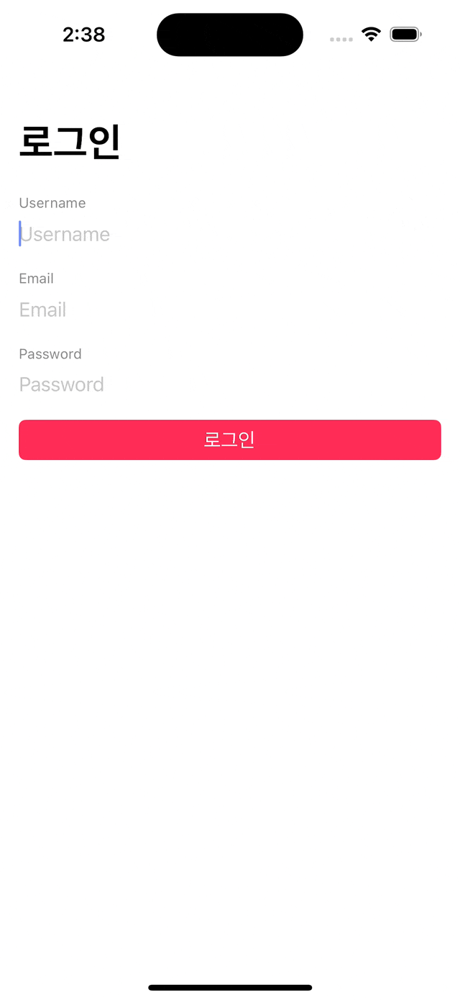
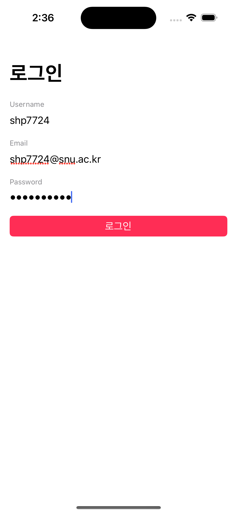
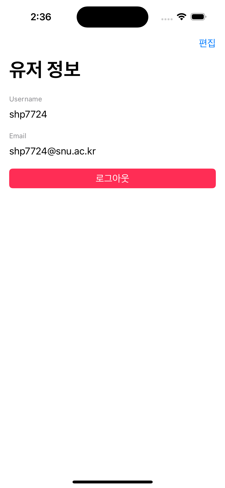
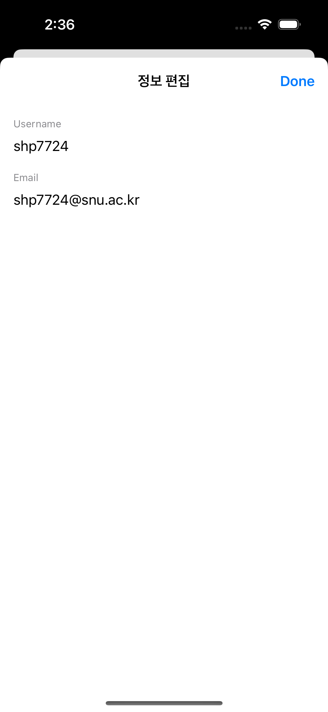

Seminar0 Assignment
================================

### **due: 2023.09.17 (일) 14:00**

## 과제 목적
- Swift, Xcode, iOS의 기본 UI 객체에 익숙해집니다.
- 뷰 간 라우팅과 오토 레이아웃을 이해합니다.
- 구글링에 익숙해집니다.

## 과제 - 간단한 로그인 뷰 만들기

아래와 같이 동작하는 앱을 만들어주세요.

### 1. 로그인 화면
- [ ] `UITextField`를 통해 `username`, `email`, `password`를 입력 받습니다.
- [ ] `로그인` 버튼을 탭하면 다음 뷰 컨트롤러로 이동합니다. 이동한 뷰에서 입력받은 `username`과 `email`을 보여줍니다.
- [ ] 다음 뷰 컨트롤러로 이동할 때에는 Stack Navigation 방식을 이용해야 합니다.
- [ ] `username`이 세 글자 미만일 때, `로그인` 버튼을 클릭하면 `username은 세 글자 이상이어야 합니다.` 라는 메시지의 알러트를 띄웁니다.
- [ ] 비밀번호 텍스트필드는 입력 시 `***`와 같이 마스킹됩니다.
- [ ] 세 개의 텍스트필드는 하나의 `UIStackView`로 감싸져 있어야 합니다.

### 2. 유저 정보 화면
- [ ] 홈 화면에서 넘겨준 `username`과 `email`을 보여줍니다.
- [ ] 두 개의 라벨 하단에 `로그아웃` 버튼이 있으며, 탭하면 다시 홈 화면으로 돌아갑니다.
- [ ] 이 화면에서 유저 정보는 편집이 불가능해야 합니다.
- [ ] 우측 상단에 위치한 편집 버튼을 누르면 편집 화면으로 이동해야 합니다. 이때 Modal Presentation 방식을 이용해야 합니다.

### 3. 편집 화면

- [ ] `username`과 `email`을 편집할 수 있습니다.
- [ ] 완료 버튼은 반드시 우측 상단 네비게이션 바에 위치해야 합니다.
- [ ] 완료 버튼을 누르면 변경된 정보가 유저 정보에 표시되어야 합니다.
  - 힌트: Delegate Pattern을 사용하는 것도 여러 해결 방법 중 하나입니다.

## 체크 리스트
- [ ] Storyboard를 사용하지 않고 코드로만 뷰를 구성해주세요.
  - [참고 자료](https://medium.com/@yatimistark/removing-storyboard-from-app-xcode-14-swift-5-2c707deb858)
- [ ] 모든 뷰에는 오토 레이아웃이 적용되어 있어야 합니다.
- [ ] 다음 뷰로 이동할 때, `username`과 `email`을 포함하는 `UserInfo` 구조체(`struct`)를 만들어 전달해주세요.

## (선택) 추가 챌린지

- [ ] 홈 화면에서 `username`, `email`, `password`를 입력하고 유저 정보 화면으로 넘어간 후, 앱을 종료하고 다시 실행해도 홈 화면이 아닌 직전에 로그인한 유저 정보가 표시되도록 구현해주세요.
  - 힌트: `SceneDelegate`, `UserDefaults`, `Codable`

## 참고 키워드
1. UIView
2. UIViewController / initialize promagramatically / present / dismiss / safeAreaLayoutGuide
3. UINavigationController / rootViewController / pushViewController / popViewController
4. AutoLayout / Constraints
5. UITextfield
6. UILabel
7. Delegate Pattern
8. struct (구조체) / class (클래스) / OOP / value type, reference type
9. Github fork / pull request 
10. UIButton / addTarget / @objc func / addAction

