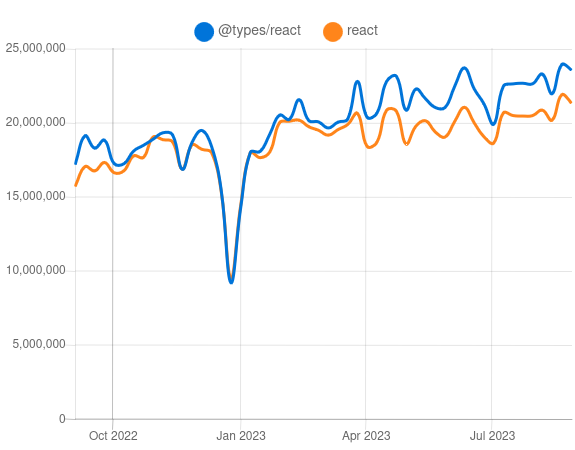
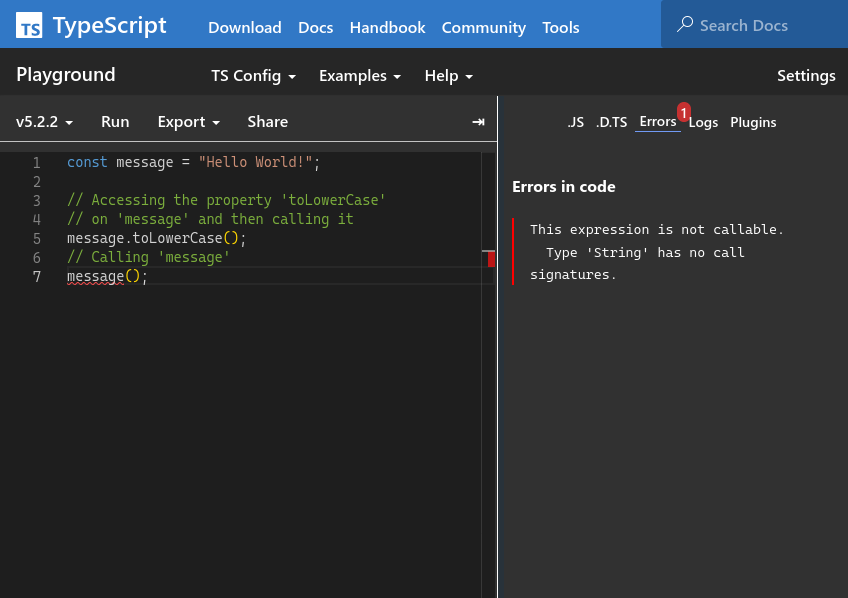
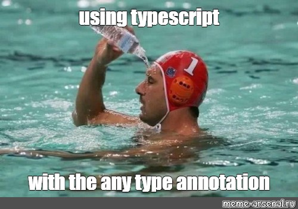
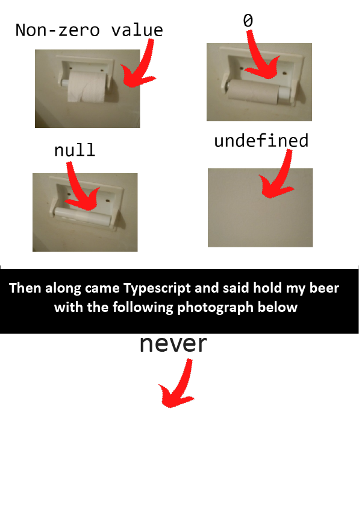

<!-- _class: lead -->

<style>
section {
  justify-content: flex-start;
}
section.lead {
  justify-content: center;
}
section.lead > h1 {
  font-size: 3rem;
}
ul {
  margin-bottom: 1rem;
}
li + li {
  margin: 0;
}
h1 {
  word-break: keep-all;
}
section.qsmall > blockquote {
  font-size: 0.9rem;
}


</style>

# 와플스튜디오 프론트엔드 세미나 - 0.5

---


# 개요

- 타입스크립트
- 타입 어노테이션
- 여러가지 타입
- 제네릭 타입
- 타입 거르기
- 예제: 함수형 프로그래밍

---

<!-- _class: lead -->

# 타입스크립트



---

# 타입스크립트란?

- 마이크로소프트가 개발한 자바스크립트 방언 및 컴파일러
- 자바스크립트를 쓰면서 생길 수 있는 타입 관련 오류를 잡아준다

---

# 온라인 놀이터

- 온라인 놀이터: https://www.typescriptlang.org/play


---

# tsc

tsc: 타입스크립트 컴파일러.
- npm의 typescript 패키지를 통해 설치할 수 있다.
- vite의 react-ts 템플릿으로 생성한 프로젝트에는 기본으로 설치됨
- (시연)
```sh
npm create vite@latest <프로젝트 이름> --template react-ts
# 또는 yarn create vite ...
```

---

# tsconfig.json

tsconfig.json: 타입스크립트 빌드 및 타입 검사 설정 파일
- (열어보기)

---

# Q&A

---

<!-- _class: lead -->

# 타입 어노테이션



---

# 간단한 타입 추론

일단 타입스크립트를 쓰는 것만으로도 많은 오류를 실행 전에 잡아준다.

```ts
function add(a, b) {
  return a + b;
}

add(0.5, 1,5);
```

JS
> (조용히 1.5를 리턴)

TS
> Expected 2 arguments, but got 3.

---

# 타입 어노테이션

의도한 타입을 써주면 실제 값이 해당 타입인지 확인해준다.

```ts
function add(a: number, b: number) {
  return a + b;
}

add("2", 3);
```

> Argument of type 'string' is not assignable to parameter of type 'number'.

---

<!-- _class: qsmall -->

# 타입 어노테이션 달 수 있는 곳

- 필수: 함수 파라미터
- 선택: 함수 리턴 타입, 변수
  - 코드의 가독성을 높이기 위해
  - 예상한 타입과 추론한 타입이 맞는지 확인하기 위해

```ts
function add(a: number, b: number): number {
  if (!Number.isNaN(a) && !Number.isNaN(b))
    return a + b;
}
const x = 3;
const y = 4;
const z: number = add(x, y);
```

> Function lacks ending return statement and return type does not include 'undefined'.

---

# Q&A

---

<!-- _class: lead -->

# 여러가지 타입


---

# 단순한 타입

```ts
const a: number = 3;
const b: string = "hello";
const c: boolean = true;

const x: undefined = undefined;
const y: null = null;

function print(): void {
  console.log("hello");
}

function error(): never {
  throw new Error("this function never return");
}
```


---

# 배열, 튜플, 함수

```ts
const a: number[] = [1, 2, 3];
const b: string[][] = [['a', 'b'], ['c']];

const c: [string, number] = ["answer", 42];

const f: (x: number) => string = (x) => x.toString();
const g: () => number = () => -1;
```

---

# 타입 별명(type alias)

```ts
type T = number;
const a: T = 3;

type U = [T, string];
const b: U = [1, "hello"];
```

---

# 오브젝트

```ts
type Todo = {
  id: number;
  text: string;
};

type User = {
  name: string;
  todos: Todo[]
};

const todo: Todo = { id: 1, text: "yey" };
const user: User = {
  name: "Ahn",
  todos: [todo, { id: 2, text: "hoh" }]
};
```

---

# 상수 타입

```ts
const a: 3 = 3;
const b: "hello" = "hello";
const c: true = true;
```

---

# Union: 둘 중 하나

```ts
function hello(name: string | null) {
  if (name === null) console.log("...");
  else               console.log("Hello, " + name + "!");
}
hello("Ahn"); // Hello, Ahn!
hello(null);  // ...

type User = {
  name: string;
  role: "user" | "admin" | "guest";
};
const users: User[] = [
  { name: "Ahn", role: "admin" },
  { name: "Woo", role: "user"  }
];

```

---

# Optional: 있든 말든

```ts
function hello(name?: string) {
  // name은 string | undefined로 사용된다
  if (name === undefined) { ... }
  else { ... }
}

type User = {
  name: string;
  age?: number;
};

const users: User[] = [
  { name: "Ahn", age: 22 },
  { name: "Woo" }
];
```

---

# Q&A

---

# any: 타입 검사 거부

- 타입 어노테이션으로는 쓰지 말자

```ts
// 타입 검사 통과
function f(x: any) {
  const z = x.a.b.c.d.e.f.g().h().i++; // x.a is undefined
  return z * 3;
}

f(4);
```


---

# unknown: 모르는 타입, 몰라도 되는 타입

```ts
function message(x: unknown) {
  console.log("message:", x);
}

message({ a: 1 });
```

---

# type assertion: 타입 우기기


```ts
const x: number = "a" as number;
```

- 타입 오류가 절대 없지만 타입스크립트가 타입 안전성을 보증하지 못하는 경우 사용.

---

# Subtype Polymorphism

타입이 다르더라도 경우에 따라 대입할 수 있다.

```ts
function foo(x: { text: string }) { ... }
function bar(x: string | number) { ... }

const item = { text: "hello", id: 3 };

foo(item); // ok
bar(item.text); // ok
bar(item.id); // ok
```

T 타입의 변수를 U 타입처럼 쓸 수 있다면 T는 U의 subtype

---

# Subtype Polymorphism

몇 가지 규칙이 있다. [타입스크립트 소책자](https://www.typescriptlang.org/docs/handbook/type-compatibility.html) 참고.
(또는 &lt;프로그래밍의 원리> 수업 수강)

```ts
const item = { text: "hello", id: 3 };
const a: { text: string } = item;
const b: { text: string | number } = item;

const foo = () => 3;
const f: (x: string) => number = foo;
const g: () => void = foo;
```

---

# Q&A

---

<!-- _class: lead -->

# 제네릭 타입


---

# 예: 항등 함수

아래 함수의 타입은 무엇인가?

```ts
function identity(x) {
  return x;
}
```

- `number => number`로도 쓸 수 있고 `string => string`으로도 쓸 수 있다.
- 모든 T에 대해 `T => T`로 쓸 수 있다.
- 하지만 `x`에 뭐가 들어올지 모르니 `unknown => unknown`?

---

# 제네릭 함수

```ts
function identity<T>(x: T): T {
  return x;
}
```

- 모든 T에 대해, `T => T`로 쓸 수 있다.

---

# 제네릭 함수의 사용

```ts
function identity<T>(x: T): T {
  return x;
}

identity<number>(3);
identity("hello");             // string으로 추론
identity(null);                // null로 추론
identity<number | null>(null); // number | null로 지정됨
```

---

# 제네릭 타입 별명

```ts
type Tree<T> = {
  item: T;
  left?: Tree<T>;
  right?: Tree<T>;
};

const t: Tree<string> = {
  item:  "yes",
  left:  { item: "foo" },
  right: { item: "bar" }
}
```


---

# Q&A

---

<!-- _class: lead -->

# 타입 거르기


---

# 타입은 바뀐다

- 변수가 가질 수 있는 값의 집합은 프로그램 내의 위치에 따라 달라진다.

```ts
function incr(x: number | null) {
  // x = null, 0, 1, 2, ...
  if (x !== null) {
    // x = 0, 1, 2, ...
    return x + 1;
  } else {
    // x = null
    return null;
  }
}
```

---

# 타입은 바뀐다는 것을 타입스크립트는 안다

- 이와 같은 타입 변화를 타입스크립트는 잘 이해한다.

```ts
function incr(x: number | null) {
  // x: number | null
  if (x !== null) {
    // x: number
    return x + 1;
  } else {
    // x: null
    return null;
  }
}
```

---

# Tagged Union

```ts
type OkResult = {
  state: "ok";
  body: { content: text };
};

type ErrorResult = {
  state: "error";
  error: Error;
};

function process(res: OkResult | ErrorResult) {
  if (res.state === "ok") {
    console.log("content:", res.body.text);
  } else {
    console.error("ERROR!");
  }
}
```

---

# Q&A

---

<!-- _class: lead -->

# 예제: 함수형 프로그래밍


---

# 함수형 프로그래밍

- 함수를 값으로 쓰는 세계
- 웬만한 현대적 프로그래밍 언어에서 지원
- 리액트 개발자에게 권장되는 패러다임 (feat. 불변성)

```js
btn.addEventListener('click', () => {
  console.log("clicked");
});

[1, 2, 3].forEach(n => n * 3); // [3, 6, 9]
```

---

# HTMLElement.addEventListener

- 아래 코드가 타입이 올바르다면 btn은 어떤 오브젝트 타입일까?

```js
btn.on('click', () => {
  console.log("clicked");
});
```

* `{ on: (e: string, () => void) }`

---

# Array.map

```js
[1, 2, 3].map(n => n * 3); // [3, 6, 9]
```

* `(this: T[], f: T => U) => U`

---

# Array.filter

```js
[1, 2, 3, 4, 5].filter(n => n % 2 === 0); // [2, 4]
```

* `(this: T[], f: T => boolean) => T[]`

---

# Array.every & Array.some

```js
[1, 2, 3, 4, 5].some(n => n % 2 === 0); // true
```

* `(this: T[], f: T => boolean) => boolean`

---

# Array.reduce

```js
[1, 2, 3, 4, 5].reduce((a, b) => a * b); // 120
```

* `(this: T[], f: (a: T, b: T) => T) => T`

---

# Q&A

---
