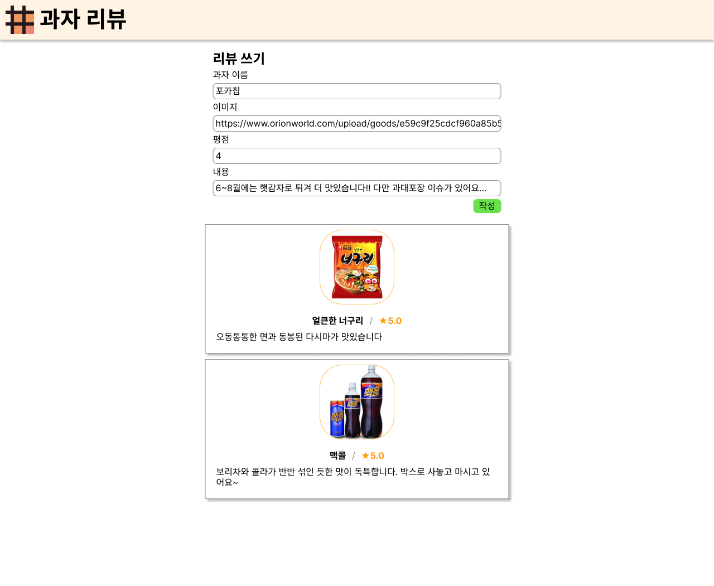

# React 과제 0

* 기한: 9/15 금요일 밤 24:00 (토요일 넘어갈 때)

과제가 둘 있습니다. 채점은 빡세게 안 합니다. 하지만 지금 해놓지 않으면 나중에 개고생 하십니다.
지금이 학기중에 가장 의지와 시간이 가득한 때 아닙니까? 열심히 해보시기 바랍니다.

과제 제출 방법은 [가이드](../hw-guide.md)를 참고하세요

# 과제 0A

아래 화면과 같은 웹사이트를 만들어오세요.



과제의 목적은 아래와 같습니다:

- HTML을 CSS, JS와 함께 사용하는 데에 익숙해진다.
- 과제 제출에 익숙해진다.
- 구글링에 익숙해진다.

## 요구사항

- README 작성
  - 과제 레포 루트에 README.md 파일이 있어야 합니다.
  - 자신의 개발 및 테스트 환경을 작성해주세요: OS, 브라우저
  - 후술할 과제 0B로 제출할 사진을 포함해주세요.

- 파일 구조
  - 과제 레포 루트에 index.html 파일이 있어야 합니다.
  - js, css, 이미지 등 다른 파일도 함께 포함되어도 괜찮습니다.
  - (참고) 대략 아래 과정으로 실행해 채점할 예정입니다:
  ```
  git clone https://github.com/waldo/waffle-react-hw0 waldo/hw0
  cd waldo/hw0
  git switch hw0
  npx serve -l 3000
  # 크롬을 통해 http://localhost:3000으로 접속
  ```

- 자바스크립트를 통한 구현은 작성 버튼만으로 제한한다.
  - 나머지 기능은 자바스크립트 없이 HTML로 구현한다.
- '작성' 버튼: 누르면 입력한 내용을 바탕으로 새로운 리뷰가 추가된다.
  - 단, 공백을 제외한 과자 이름이 1자도 안 되거나, 과자 이름이 너무 길거나(20자 초과), 리뷰 내용이 너무 짧거나(5자 미만), 너무 길거나(1000자 초과) 평점이 1~5 사이의 자연수가 아니면 추가할 수 없다는 메시지를 이유와 함께 보여준다.
  - 이미지가 비어있는 경우 적당한 대체 이미지를 보여준다.
- 이미지
  - 이미지가 나오는 칸은 일정한 크기로 고정한다.
  - 이미지를 불러올 수 없는 경우 적당한 대체 텍스트를 보여준다.
- '리뷰 쓰기'
  - "과자 이름", "이미지" 등 입력창 위의 텍스트를 클릭하면 해당 입력창으로 포커스가 이동하여 바로 내용을 쓸 수 있게 된다.
  - 입력창이 비어있는 경우 적당한 예시를 흐린 색으로 보여준다. 이를테면, 이미지 입력창에는 `예시: https://www.example.com/image.png`가 나타난다.
- 헤더
  - 헤더 이미지나 제목("과자 리뷰")을 클릭하면 와플스튜디오 홈페이지(`https://wafflestudio.com`)로 이동한다.
  - 참고: 헤더의 로고는 와플스튜디오 홈페이지에서 적당히 복사해온다.
- 디자인 및 레이아웃
  - 색상, 글자 크기, 폰트 두께, 요소 간 간격, 여백, 배치, 테두리 모양, 그림자는 이미지와 비슷하게 맞춘다.
  - 이미지 입력창의 내용이 넘치면 좌우 스크롤이 생긴다.
  - 내용 입력창의 내용이 넘치면 상하 스크롤이 생긴다.
  - 불-편한 강제개행, 삐져나감, 짜부 및 느을어남, 스크롤 없이 잘림, 서로 겹침, 불필요한 스크롤이 일어나지 않도록 한다.
  - 아무튼 척 보기에 이상한 현상은 없도록 한다.

# 과제 0B

- vite를 통해 React + Typescript 프로젝트를 생성하고 코드를 수정하여 `Vite + React`가 있던 자리에 `깃허브아이디 + React`가 나타나게 하세요.
- 실행한 화면을 캡처하여 과제 0A의 README에 포함하세요.
- 참고: https://velog.io/@homile/react-vite
