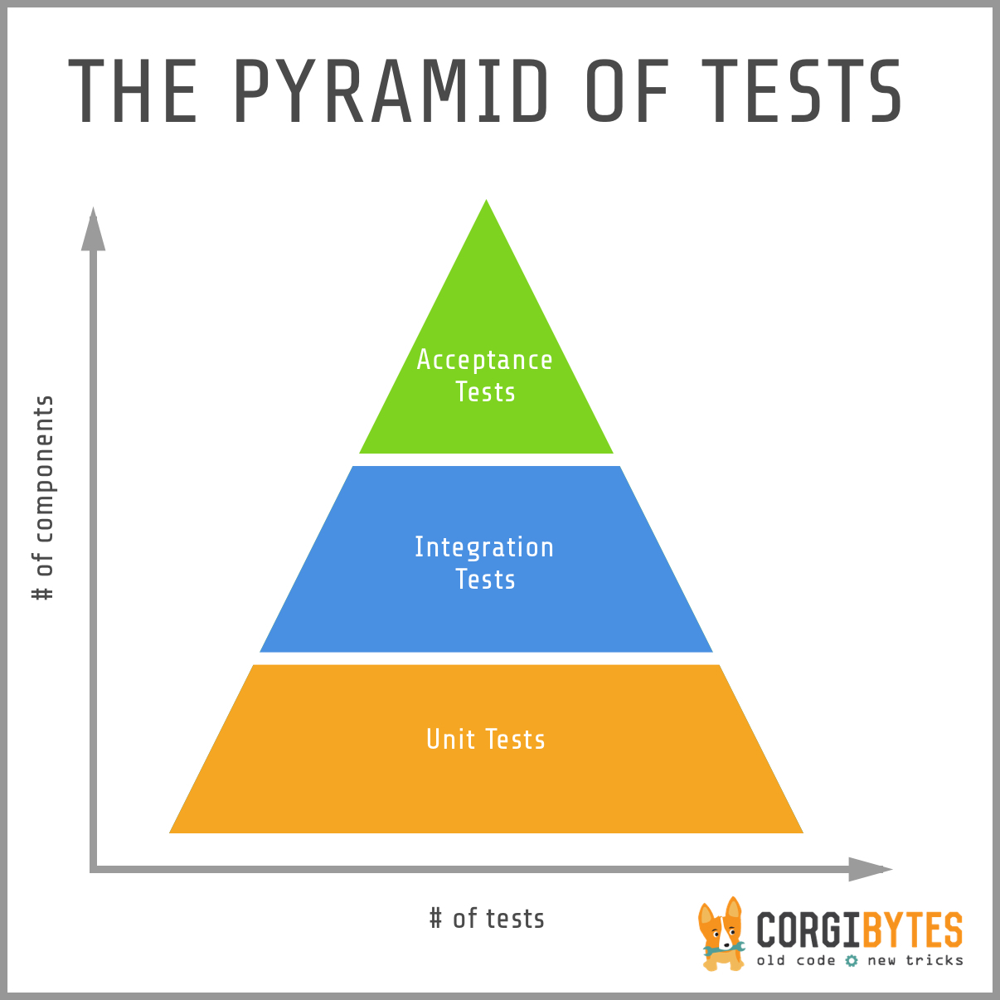
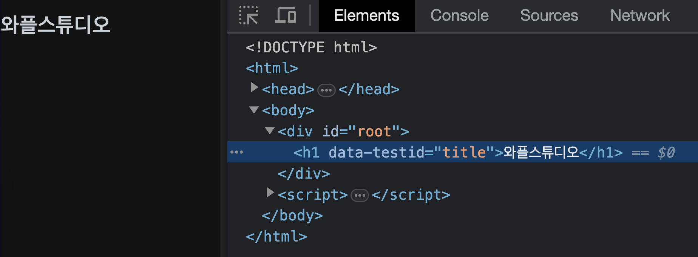
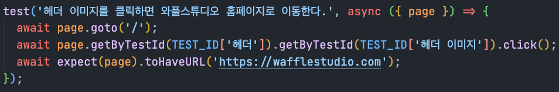
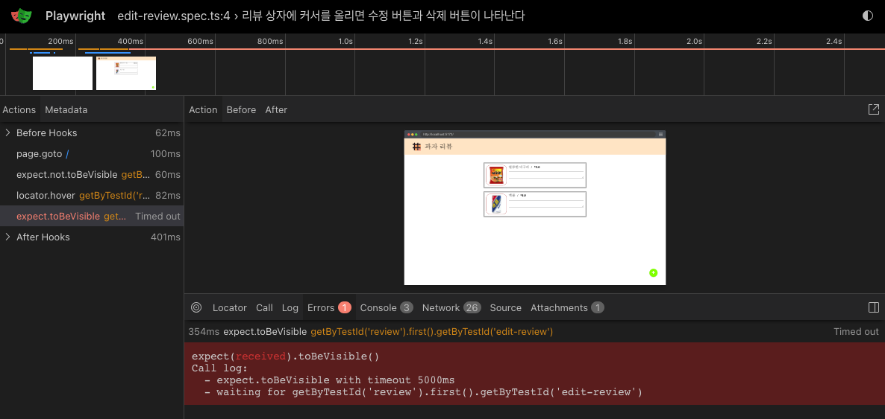
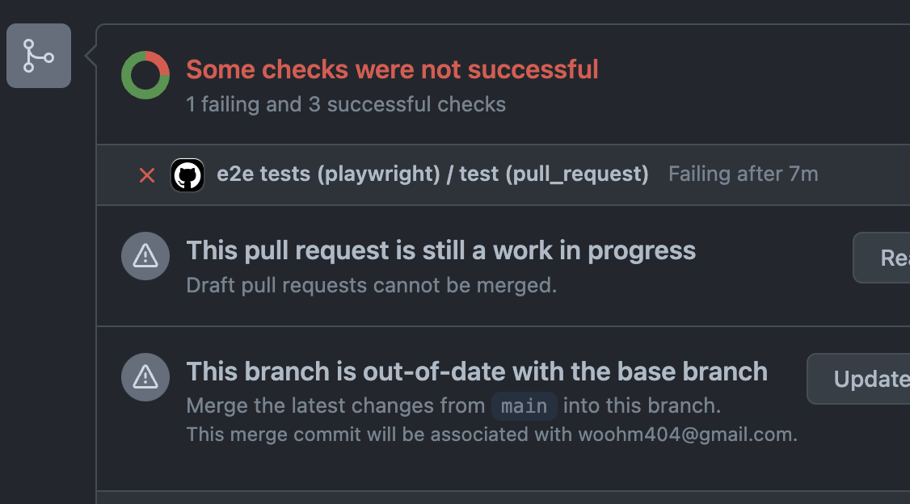
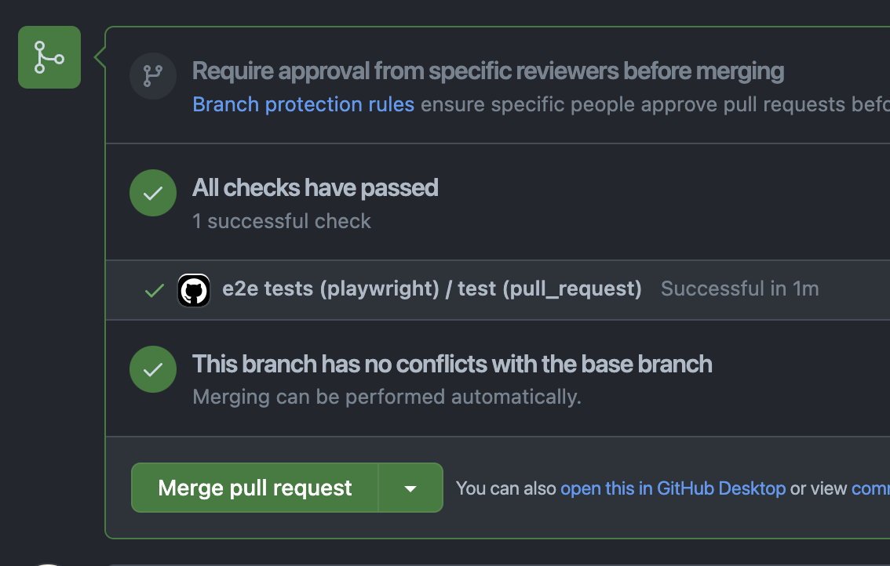

<!-- _class: lead -->

<style>
@import "https://cdnjs.cloudflare.com/ajax/libs/highlight.js/11.8.0/styles/default.min.css";
section {
  justify-content: flex-start;
}
section.lead {
  justify-content: center;
}
section.lead > h1 {
  font-size: 3rem;
}
ul {
  margin-bottom: 1rem;
}
</style>

# Waffle Studio<br>Frontend Seminar - 1.5<br/>

### \*강의자료 work in progress 입니다.

---

<!-- @joongwon part -->

# CSS Layout

---

<!-- @woohm402 part -->

<!-- _class: lead -->

# Testing

---

# 개요

어플리케이션이 잘 동작하는지 확인하려면, 동작하는지 일일이 확인해야 한다

코드가 수정되면 각 로직이 서로 영향을 조금씩이라도 끼치기 때문에, 결국 어플리케이션의 안정성을 보장하려면 전체 어플리케이션을 다시 테스트해야 한다

자동화할 수 없을까?

---

# 개요

내가 짠 코드가 있고,

```ts
// add.ts
export const add = (a: number, b: number) => a + b;
```

내 코드를 테스트하는 코드가 있다.

```ts
// add.test.ts
import { add } from "./add";

expect(add(1, 2)).toBe(3);
expect(add(2, 3)).toBe(5);
expect(add(3, 4)).toBe(7);
```

_설명 편의를 위한 코드입니다. 실제로 세미나에서는 이런 코드를 볼 일은 없습니다._

---

# 개요

테스트의 여러 종류



---

# Unit Test VS Integration Test

<br/>

|      | unit test                                                       | integration test                           |
| ---- | --------------------------------------------------------------- | ------------------------------------------ |
| 정의 | 하나의 함수나 모듈을 단위로 테스트                              | 여러 모듈이나 서비스를 통합하여 테스트     |
| 집중 | 모듈의 내부 구현에 집중                                         | 모듈이 상호작용하여 어떻게 동작하는지 집중 |
| 예시 | 엑셀을 누르면 엔진이 일하는지 <br/> 엔진이 일하면 바퀴가 도는지 | 엑셀을 밟으면 차가 가는지                  |
| 도구 | `jest` 등                                                       | `cypress`, `playwright` 등                 |

---

# Unit Test VS Integration Test

unit test 는 코드 구조에 강하게 결합되어 있으므로 코드 리팩토링을 할 때 unit testcode를 같이 수정해줘야 한다는 단점

integration test 는 테스트 수행이 오래 걸리기 때문에 엄청나게 다양한 케이스들을 커버하기 어려움

스켈레톤을 짜드리는 게 아니므로 단위 테스트는 하기 어려운 환경이기에, **_우리 과제에서는 기본적으로 Integration Test 를 합니다._**

<br/>

\*관점에 따라 Integration Test 가 아니라 E2E 테스트라고 보일 수도 있습니다. 하지만 길게 봤을 때 백엔드가 붙어도 우리는 프론트엔드만 커버할 것이므로 Integration이라고 칭하겠습니다.

\*지금은 E2E인지 Integration인지 구분하는 거 별로 중요하지 않습니다.

---

# 궁금증

## 테스트를 통과했으면 버그가 없다고 확신할 수 있나요?

**절대 그렇지 않습니다**. 테스트코드가 체크해주는 것은 어디까지나 한계가 있고 결국 어플리케이션이 잘 동작하는지를 체크해줄 수는 없습니다.

그럼에도 테스트코드가 가지는 가치는, 내가 개발해야 할 기능을 명확하게 정의해줌으로서 개발을 더 효율적으로 할 수 있게 해 주고, 내 어플리케이션에 최소한의 안정성을 보장해준다는 데에 있습니다.

---

# 궁금증

## 테스트는 얼마나 촘촘하게 짜야 하나요?

테스트코드도 코드입니다. 즉 100% 신뢰할 수 있는 대상이 아닙니다. 테스트코드를 짜는데에도 시간이 들고, 테스트코드를 유지보수하는데에도 시간이 듭니다. 따라서 테스트코드를 짜는 것은 효율적인 투자가 되어야 합니다.

사실 이번 세미나에서 테스트코드는 저희가 짜 드리는 만큼 일단은 크게 신경쓰지 않으셔도 괜찮습니다.

---

# 궁금증

## 테스트에 대한 현업 분위기는 어떤가요?

여러 이유(와 핑계)로 테스트 문화가 잘 갖춰진 곳은 많지 않고, 실제로 테스팅을 하지 않는 곳도 많습니다.

특히 프론트엔드의 경우 테스트로 보장할 수 있는 영역에 한계가 있다 보니 (css 테스트하기 어렵고, 브라우저마다 동작 다르고 등등) 더 그렇습니다. 안드로이드나 ios도 마찬가지입니다.

그럼에도 다들 테스트의 필요성에 대해 인지하고 있고, 테스트를 짜는 개발자를 좋게 봅니다.

---

# Integration Test with Playwright

일반적으로 아래의 프로세스를 거칩니다.

- 브라우저를 연다
- 사이트에 접속한다 (아마도 localhost)
- 사전에 정의된 테스트케이스들을 수행한다

---

# Integration Test with Playwright

### 엘리먼트를 어떻게 지정할까?

브라우저는 열었습니다. "+" 버튼 클릭을 테스트하고 싶습니다. 어떻게 해야 할까요?

- 화면 왼쪽에서 500px, 위에서 300px 위치를 클릭한다
- `id` 프로퍼티가 `submit-button`인 엘리먼트를 클릭한다
- `<body>` 밑에 두번째 `<div>` 밑에 `<section>` 밑에 있는 `<button>`을 클릭한다
- 텍스트가 `제출` 인 `<button>` 엘리먼트를 클릭한다

... 등등 많은 방법이 있습니다. 실제로 이 방법들은 모두 가능합니다.

---

# Integration Test with Playwright

### 엘리먼트를 어떻게 지정할까?

하지만 엘리먼트의 위치나 돔 구조에 결합된 테스트는 관리하기 어렵습니다. 가령 "화면 왼쪽에서 500px을 클릭했을 때" 로 해 버리면, css가 조금 바뀌면 테스트도 다 고쳐줘야 합니다. 나머지도 비슷한 문제가 있습니다.

id 나 class 같은 것들을 이용해서도 요소를 특정할 수 있지만, 의미가 명확하지 않고 원치 않은 기능이 생겨버릴 수도 있습니다. (특히 `id` 프로퍼티의 경우)

---

# Integration Test with Playwright

### `data-testid`

어떻게 스타일을 짜고 어떻게 돔 구조를 설계하든 테스트가 잘 돌아가게 하려면, `data-testid` 프로퍼티를 이용해야 합니다.

```tsx
<div data-testid="asdf"></div>
```

`data-*` 속성들은 일반적으로 브라우저가 무시하는 속성입니다. 따라서 이 속성을 이용하면, 테스트를 위한 엘리먼트를 마음대로 지정할 수 있습니다.

대부분의 테스트 도구들은 `data-testid` 라는 이름의 속성으로 이용해 엘리먼트를 지정하는 걸 권장하고, `data-testid` 속성에 편하게 접근할 수 있도록 `getByTestId()` 와 같은 api를 제공합니다.

---

# Integration Test with Playwright

### `data-testid`

```ts
expect(page.getByTestId("title")).toHaveText("와플스튜디오");
```



---

# Integration Test with Playwright

### 예시

1. `/` 경로에 접속해서
2. 헤더의 로고 이미지를 클릭하면
3. url이 `https://wafflestudio.com` 으로 변경된다



---

# Integration Test with Playwright

## Live Example




---

# 과제 할 때 어떻게 하면 되나요?

원래는 테스트도 직접 짜면서 TDD를 하는 게 권장되지만, 세미나에서 이렇게까지 하기는 무리가 있기 때문에 테스트케이스는 미리 짜두었습니다. 과제 스펙에 맞추어 `data-testid`를 적절하게 셋업해주시면 됩니다.

직접 짠 게 아닌 남이 짠 테스트코드인지라, 계획하신 마크업과 테스트코드가 요구하는 마크업이 다를 수 있습니다. 분명 정상 동작하고 스펙도 다 잘 돌아가는데 테스트만 터지는 억울한 상황이 있을 수도 있습니다. 저희도 이 부분을 인지하고 있으니 어려운 게 있다면 편하게 질문주세요 :)

---

## CI (Continuous Integration: 지속적인 통합)

CI 도구 (CircleCI, TravisCI, Github Actions 등) 가 자동으로 내 코드를 기준으로 자동화 테스트, 린트 체크 등을 수행한다

## GitHub Actions

- GitHub에서 제공하는 CI 도구
- repository 루트의 `.github/workflows/` 폴더에 yml 파일을 추가하면 자동으로 동작한다
- CI 파일도 미리 만들어드렸습니다 (과제 1의 경우 [`playwright.yml`](https://github.com/wafflestudio/seminar-2023/blob/main/react/1/hw-test/playwright.yml))

---

# 과제 할 때 어떻게 하면 되나요?

## 로컬 개발환경 가이드

1. `5173`번 포트에 과제 어플리케이션 띄우기
   - 개발모드: `yarn dev` / 프로덕션: `yarn build && yarn preview --port 5173`
   - 자동화 테스트는 프로덕션 빌드를 이용하긴 하는데, 기본적으로 개발빌드든 프로덕션 빌드든 둘다 테스트 통과해야 합니다. 개발빌드가 편할거예요
2. git clone 했던 `seminar-2023/react/1/hw-test/` 로 진입
3. `yarn install` 로 의존성 설치하고, `npx playwright@1.38.0 install --with-deps` 로 playwright 브라우저 설치
4. `yarn test` 로 테스트 수행

---

# 과제 할 때 어떻게 하면 되나요?

## CI 테스트환경 가이드

1. 과제 스펙에 있는 대로, 만들어드린 yml 파일을 `.github/workflows/playwright.yml` 로 복사
2. 과제 브랜치 (이번에는 `hw1`) -> `main` 으로 PR 생성
3. 푸시하는 대로 github actions 가 테스트를 계속 돌릴거예요
4. 통과하게 만들어주시면 됩니다

| 실패 시                         | 성공 시                         |
| ------------------------------- | ------------------------------- |
|  |  |

계속 실패 뜨는게 거슬린다면, `playwright.yml`은 로컬 테스트환경에서 개발 다 끝나고 마지막에 세팅해주셔도 좋습니다.

---

# 과제 할 때 어떻게 하면 되나요?

## 로컬 테스트 timeout 관련

각 테스트케이스 timeout이 로컬에서 2초 / CI환경에서 5초로 걸려 있습니다.

컴퓨터 성능이 좋지 않은 경우 더 오래 걸릴 수도 있는데, 2초가 넘게 걸리면 테스트가 실패로 처리됩니다. 이런 상황이 의심될 경우 playwright.config.ts 파일에서 5초 정도로 조정해 주시면 로컬에서도 테스트가 통과할 수 있습니다.
