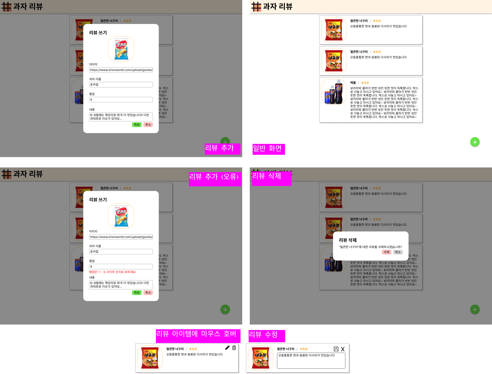

# React 과제 1

* 수정(9/23): 이미지 관련 스펙이 수정되었습니다.
* 기한: 10/3 화요일 밤 24:00 (수요일 넘어갈 때)

## 과제 목적

- vite을 통해 리액트 싱글 페이지 앱(SPA)을 만들 수 있다.
- 리액트 싱글 페이지 앱을 AWS S3와 Cloudfront를 통해 배포할 수 있다.

## 과제 스펙

목표: 아래와 같은 과자 리뷰 커뮤니티를 만드세요.

스펙에 중간중간 (세미나장의 사견이 들어있는) 힌트를 넣어두었습니다.
힌트 없이도 잘 구현이 되었다면 신경쓸 필요 없습니다.

- 개요
  - vite으로 프로젝트를 생성한다.
  - 리액트로 추가, 수정, 삭제 기능이 있는 과자 리뷰 커뮤니티를 만든다.
  - 리뷰에는 과자 이름, 이미지, 평점, 내용이 포함된다.
- **주의 사항**
  - 메인 브랜치는 처음 생성한 상태 그대로 남겨둔다. 실수로 메인에 푸시한 경우 슬랙에 문의하면 세미나장과 조교가 취소할 방법을 알려줄 것이다.
  - **깃허브 웹사이트를 통해 과제 파일을 업로드하는 경우 채점하지 않는다.** git 클라이언트는 무엇을 쓰든 상관없지만, 반드시 로컬에서 커밋 & 푸시하는 절차를 거치도록 한다.
  - prettier 외에 vite이 자동으로 깔아주는 것을 제외한 어떠한 외부 패키지(jquery, @mui/material, redux 등)도 사용할 수 없다.
  - 자바스크립트 파일을 작성할 수 없다. 모든 소스코드는 타입스크립트로 작성한다.
  - 타입 검사를 무시하는 아래의 문법들은 사용해서는 안 된다. 타입을 지정하기 어려운 경우 디스커션에서 적극적으로 도움을 구하자. 세미나 운영진들조차 적절한 해결책을 찾지 못하는 경우에 한해 아래 문법들이 허용될 수 있다.
    - `any` 타입 어노테이션
    - 타입 우기기(type assertion) e. g. `"42" as number`
    - `@ts-ignore` 등 주석을 통한 타입 검사 무시
  - npm(또는 yarn)을 통해 prettier를 설치하고 `npx prettier -w <project_root>`를 실행하여 읽기 좋은 코드로 제출한다.
- 초기 데이터는 [이 파일](data.json)의 데이터를 사용한다. **데이터의 제약 조건**은 다음과 같다.
  - `id`: 리뷰의 id. 모든 리뷰는 서로 다른 자연수를 아이디로 갖는다.
  - `snack_name`: 과자 이름. 첫글자와 끝글자가 공백이 아닌 1~20자의 문자열.
  - `image`: 이미지 url. 실제 이미지를 가리키는 url을 넣어야 한다. (hw0와 달리, 반드시 1자 이상의 문자열로 작성해야 한다)
  - `rating`: 평점. 1~5 사이의 정수.
  - `content`: 내용. 첫글자와 끝글자가 공백이 아닌 5~1000자의 문자열.
- 헤더
  - 헤더 이미지나 제목("과자 리뷰")을 클릭하면 와플스튜디오 홈페이지(`https://wafflestudio.com`)로 이동한다.
  - 아래와 같이 `data-testid` 속성을 설정한다.
    | 헤더 | 헤더 이미지 | 제목 |
    | --- | --- | --- |
    | `header` | `waffle-logo` | `header-title` |
- 스크롤
  - 리뷰가 많거나 길어져 화면에 들어오지 않으면 위아래로 스크롤하여 읽을 수 있다.
  - 이때 헤더, 리뷰 추가 버튼, 리뷰 쓰기 상자 등은 스크롤하여도 이동하지 않는다.
  - 아래와 같이 `data-testid` 속성을 설정한다.
    | 리뷰 목록을 감싸는 무언가 (아마 `<ul>`이겠죠?) |
    | --- |
    | `review-list` |
- 모달 공통
  - 리뷰 쓰기 버튼을 누르거나 삭제 버튼을 누르면 "모달"이 뜬다. (각 모달의 세부 동작은 아래 항목 참조)
  - 상자가 뜰 때, 스윽 올라오는 애니메이션과 함께 배경이 어두워진다: [이런 느낌](https://getbootstrap.com/docs/4.0/components/modal/#vertically-centered)
    - 배경 뒤의 UI는 사용할 수 없게 된다.
    - 배경을 클릭하면 모달이 닫힌다.
- 리뷰 쓰기
  - 우하단의 녹색 버튼을 누르면 리뷰 쓰기 모달이 뜬다.
  - 모달이 뜨는 순간 리뷰의 내용은 비어있다.
  - 리뷰의 내용을 작성하여 "작성" 버튼을 누르면 맨 위에 리뷰가 추가된다.
    - 단, 작성 버튼을 눌렀을 때 **데이터의 제약 조건**에 맞지 않는 경우, 해당 입력칸 아래에 에러 메시지를 보여준다. (스펙 이미지에서 "리뷰 추가 (오류)" 부분 참고)
    - 이미지 URL에 대해서는 제약조건을 검사하지 않아도 된다. 단, 아래의 보너스를 해결하면 좋은 일이 생길지도 모른다.
    - (보너스) 이미지 URL을 입력하면 해당 URL의 미리보기 이미지를 보여준다.
      - 단, 이미지 URL을 편집하는 동안에는 기존 이미지를 그대로 보여주거나 로딩중임을 나타내는 이미지나 텍스트를 보여준다.
      - 편집이 멈춘지 1초가 지나면 URL에 해당하는 미리보기 이미지가 나타난다.
      - 미리보기가 나타나기까지의 1초 동안은 "작성" 버튼이 비활성화되어 누를 수 없다.
      - 작성 버튼을 눌렀을 때, 미리보기 이미지가 로드되지 않았거나 로드할 수 없다면 이미지 입력칸 아래에 에러 메시지를 보여준다.
      - 힌트1: input의 value와 img의 src에 서로 다른 state를 사용한다.
      - 힌트2: setTimeout와 clearTimeout을 사용한다.
      - 힌트3: useEffect와 useRef를 쓰도록 알려주는 블로그 글이 많을 것이다. 이 기능은 해당 함수들 없이도 구현 가능하다.
  - 새 리뷰의 id는 기존 리뷰와 겹치지 않게 생성한다.
    - 힌트: 전역 변수로 다음 id로 쓸 값을 저장하거나, Date.now(), Math.random() 등의 함수를 활용하는 방법이 있다.
    - 백엔드 서버와 연결한 이후에는 이 문제에 대해 고민할 필요 없으니 적당히 해결하면 된다.
  - 아래와 같이 `data-testid` 속성을 설정한다.
    | 우하단 녹색 버튼 | 모달 (하얀 영역 wrapper) | 모달의 작성 버튼| 모달의 취소 버튼 | 이미지 인풋 | 과자이름 인풋 | 과자이름 인풋 하단 오류 메세지 | 평점 인풋 | 평점 인풋 하단 오류 메세지 | 내용 인풋 | 내용 인풋 하단 오류 메세지 |
    | --- | --- | --- | --- | --- | --- | --- | --- | --- | --- | --- |
    | `write-review` | `write-review-modal` | `submit-review` | `cancel-review` | `image-input` | `name-input` | `name-input-message` | `rating-input` | `rating-input-message` | `content-input` | `content-input-message` |
- 리뷰 수정 및 삭제
  - 리뷰 상자에 커서를 올리면 수정 버튼과 삭제 버튼이 나타난다.
    - 힌트: CSS에서 `:hover` 슈도 클래스를 사용하면 조건부 렌더링 없이도 구현할 수 있다.
  - 수정 버튼을 누르면 리뷰의 내용(`content`)을 수정할 수 있다.
    - 기본적으로 기존의 내용이 채워져있다.
    - 수정 후 저장 버튼을 누르면 저장되고, 취소 버튼을 누르면 기존 내용으로 돌아온다.
  - 한번에 하나의 리뷰만 수정할 수 있다.
    - 리뷰를 수정하는 도중에는 다른 리뷰 상자에 수정 및 삭제 버튼이 나타나지 않는다.
    - 힌트: '수정중인 리뷰의 id'를 state로 저장한다.
  - 삭제 버튼을 누르면 리뷰를 삭제할지 묻는 모달이 뜬다.
    - 다시 삭제 버튼을 누르면 해당 리뷰가 삭제된다.
    - 취소 버튼을 누르면 모달이 닫힌다.
  - 아래와 같이 `data-testid` 속성을 설정한다.
    |리뷰 상자| 수정 버튼 | 수정 시 내용 인풋 | 수정 저장 버튼 | 수정 취소 버튼 | 삭제 버튼 | 삭제 모달의 취소 버튼 | 삭제 모달의 삭제 버튼 |
    | --- | --- | --- | --- | --- | --- | --- | --- |
    | `review` | `edit-review` | `edit-review-content-input` | `edit-review-save` | `edit-review-cancel` | `delete-review` | `delete-review-cancel` | `delete-review-delete` |
- 디자인 및 레이아웃
  - 기본적으로 이미지와 비슷하게 맞춘다.
  - 폰트, 색상, 테두리 모양, 여백 등은 더 예쁘게 조정해도 좋다.
  - 클릭 가능한 요소(버튼, 링크 등)는 커서를 올리면 커서 모양이 바뀌도록 한다.
    - (선택) 추가로 버튼의 색상이나 위치 등이 약간 바뀌게 해도 좋다.
  - 불-편한 강제개행, 삐져나감, 짜부 및 느을어남, 스크롤 없이 잘림, 서로 겹침, 불필요한 스크롤이 일어나지 않도록 한다.
    - 아무튼 척 보기에 이상한 현상은 없도록 한다.
- 배포
  - aws 개인 계정을 생성하고, 과제로 만든 리액트 앱을 빌드하여 S3과 cloudfront에 배포한다.
  - cloudfront에 배포된 url을 PR과 리드미에 첨부한다.
  - 배포 방법은 [배포 가이드](s3-guide.md) 참고. 대충 휘갈겨 쓴 것이니 오류가 나면 디스커션에 질문으로 올려주시기 바랍니다.
- 테스트
  - 레포 루트의 `.github/workflows/` 폴더에 [playwright.yml](./hw-test/playwright.yml) 을 추가해 주세요.
  - PR을 올리면 PR에서 자동화 테스트가 돌 텐데, 해당 테스트가 통과해야 합니다.
  - 자동화 테스트에 대한 자세한 내용과 로컬에서 돌릴 수 있는 방법은 세미나 1.5에서 소개해 드리겠습니다.

## 제출 방법 및 제출 주의사항

- [제출 가이드](../hw-guide.md)을 참고하되 레포지토리 이름을 `waffle-react-hw1`로 합니다.
- 생성하는 브랜치의 이름은 `hw1`으로 합니다.
- 이번 과제에서 생성한 레포지토리를 앞으로의 과제에서도 사용할 예정입니다. 메인에 푸시하지 않도록 주의해주세요.

## 참고하면 좋은 것들

- [해당 문서](../study-links.md) 참조
