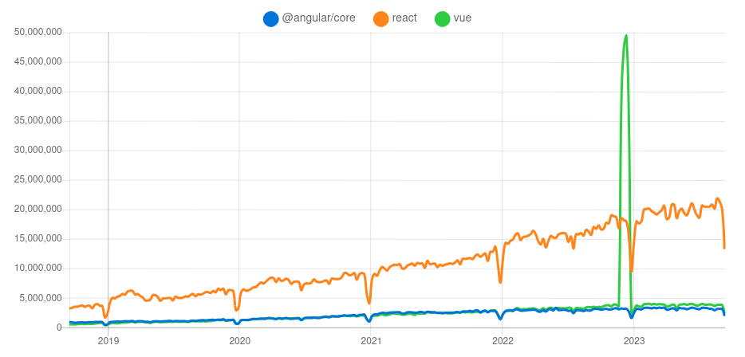
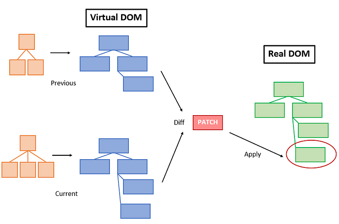
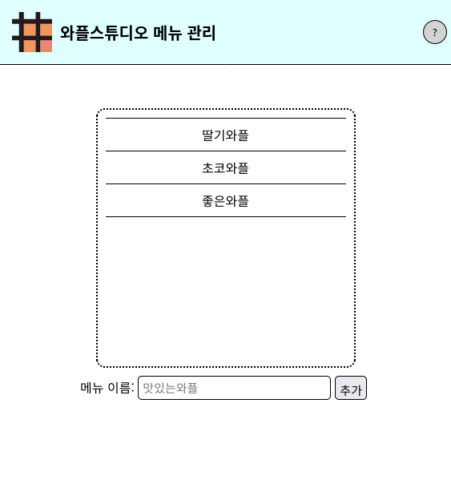
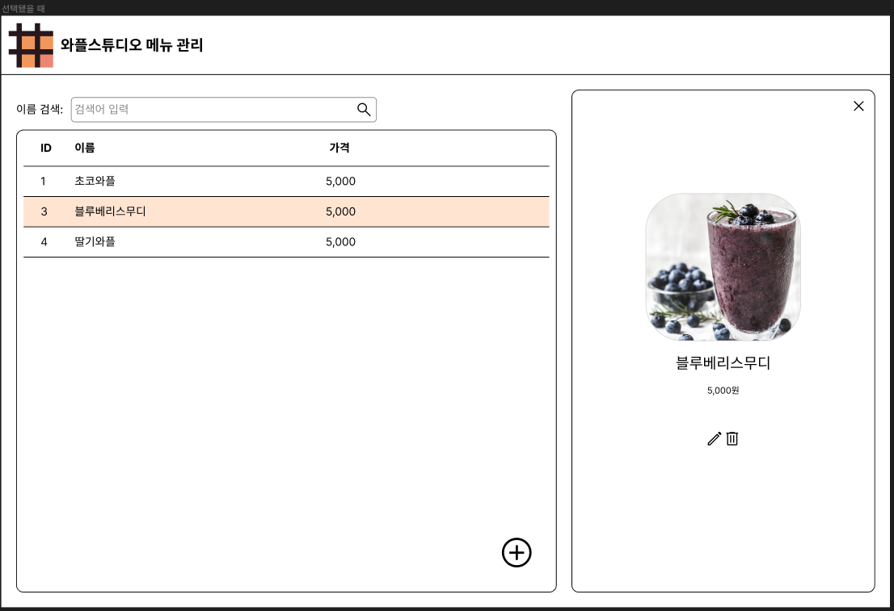
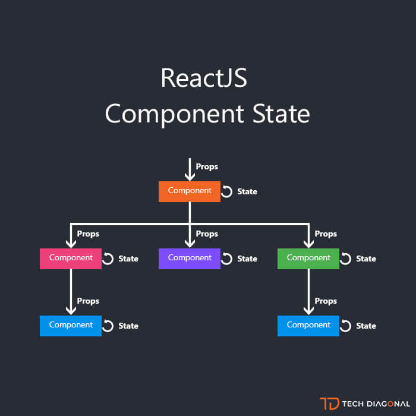
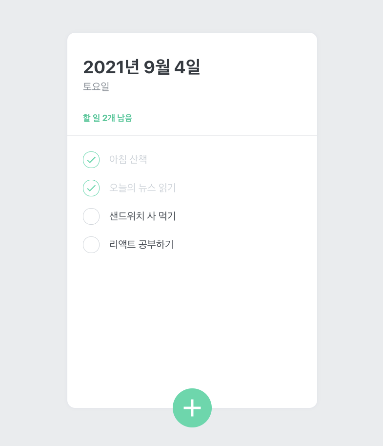
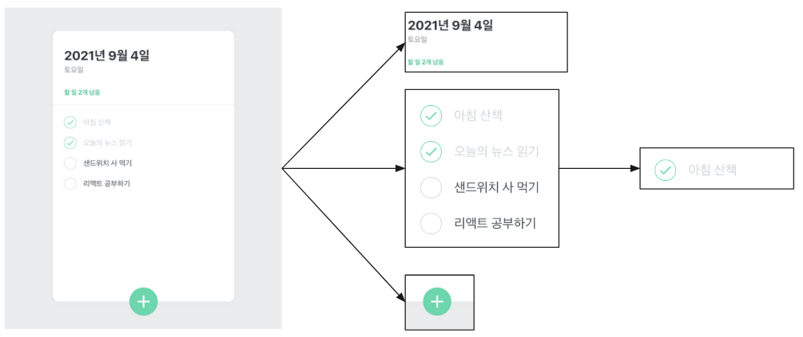

<!-- _class: lead -->

<style>
@import "https://cdnjs.cloudflare.com/ajax/libs/highlight.js/11.8.0/styles/default.min.css";
section {
  justify-content: flex-start;
}
section.lead {
  justify-content: center;
}
section.lead > h1 {
  font-size: 3rem;
}
ul {
  margin-bottom: 1rem;
}
</style>

# Waffle Studio<br>Frontend Seminar - 1

---

# 개요

- 리액트
- 함수 컴포넌트
- 예제: 할 일 목록 (Todo List)

---

<!-- _class: lead -->

# 리액트

---

# Frontend Library/Framework

- 정적인 페이지를 만드는 데는 HTML / CSS면 충분
- JS가 있다면 동적 페이지도 가능

- But, 사이트가 복잡해지고 관리해야할 상태가 많아진다면?

---

# Why React?

- 엄청난 생태계
- 많은 곳에서 사용
- Airbnb, BBC, Cloudflare, eBay, Facebook, Twitch, Yahoo...
- 편리함
- 대략 15000명의 개발자에게 설문 -> 93%가 재사용할 의향 O

---

# 자료: NPM trends



---

# React 의 특징 (리액트를 이해할 때 매우매우 중요)

- Virtual DOM
- 단방향 데이터 흐름
- 컴포넌트: 관심사의 분리
- 데이터를 넣으면, 지정한 UI를 조립
- 여러 부분을 분할해서 사용
- JSX

---

# DOM
Document Object Model (문서 객체 모델)
- HTML 문서에 접근하기 위한 일종의 인터페이스
- 브라우저가 DOM tree 를 생성


---

# Virtual DOM

- 기존의 프레임워크
  - 데이터가 바뀌면 화면에서 대응되는 부분 변화

- React
  - 데이터가 바뀌면 가상 DOM을 완전히 새로 그린다
  - 이후 바뀐 부분을 실제 DOM에 반영

---


(https://ui.toast.com/weekly-pick/ko_20210819)

---

# 단방향 데이터 흐름

- 데이터는 항상 부모에서 자식으로 흐른다
- 컴포넌트로 나누기가 쉽다


(https://github.com/javascript-webdevelopment/react-two/blob/master/images/dataflow.png)

---

# Q&A

---

<!-- _class: lead -->
# 리액트 컴포넌트

---

# JSX

- JavaScript eXtension
- HTML을 곁들인 Javascript

```jsx
const logo = "logo.png"
const output = (
 <header>
   <a href="https://wafflestudio.com">
     
     <h1>와플스튜디오 메뉴 관리</h1>
   </a>
   <hr/>
   <button id="help">?</button>
 </header>
);
```

https://react.dev/learn/writing-markup-with-jsx

---

# JSX의 간단한 문법

- 닫는 태그 필수(빈 태그의 경우 끝에 슬래시`/` 필수: `<input/>`)
- 하나의 요소만을 리턴 (여러 개를 리턴하려면 Fragment나 배열 사용)
- 내부에서 `{}`를 이용하여 자바스크립트 사용 가능
- Property 이름이 조금씩 다름
  - onclick: onClick
  - class: className
  - for: htmlFor
- false, null, undefined 등은 render하지 않음

---

<style scoped>
pre {
  font-size: 15px;
}
</style>

# React

<div style=display:flex><div style=flex:1>

App.tsx 를 보면...
- import
- function
  - jsx
- export

</div><div style=flex:2>

```jsx
import React, { useState } from 'react'
import logo from './logo.svg'
import './App.css'

function App() {
  const [count, setCount] = useState(0)

  return (
    <div className="App">
      <header className="App-header">
        
        <p>Hello Vite + React!</p>
        <p>
          <button onClick={() => setCount(count => count + 1)}>count is: {count}</button>
        </p>
        <p>
          Edit <code>App.tsx</code> and save to test HMR updates.
        </p>
        <a
          className="App-link"
          href="https://reactjs.org"
          target="_blank"
          rel="noopener noreferrer"
        >
          Learn React
        </a>
      </header>
    </div>
  )
}

export default App
```

</div>

---

# React

<div style=display:flex><div style=flex:1>

main.tsx 를 보면...

- import
- ReactDOM.render

</div><div style=flex:2>

```jsx
import React from 'react'
import ReactDOM from 'react-dom'
import './index.css'
import App from './App'

ReactDOM.render(
  <React.StrictMode>
    <App />
  </React.StrictMode>,
  document.getElementById('root')
)
```

---

# Component

<div style=display:flex><div style=flex:1>

- 재사용 가능한 UI
- 우수한 유지보수성
- 함수 컴포넌트
  - 예엣날에는 클래스 뭐시기도 있었다더라~

언어(HTML / JS)에 따라 분리하는 것이 아니라,
관심사에 따라 컴포넌트로 분리

</div><div style=flex:0.7>

```jsx
// Example.tsx
import React from "react";
const Example = () => {
  return <div>this is an example</div>;
}
// App.tsx
import Example from "./Example";

const App = () => {
 return (
   <div>
     <Example />
     <Example />
   </div>
 );
}
```

</div>

---

<style scoped>p { text-align: center }</style>

# Component를 어떻게 분리할까?



---

# Component를 어떻게 분리할까?

<style scoped>p { text-align: center }</style>



---

# State/Props

- state
  - 동적인 데이터
  - 지역 변수 비슷한 것
  - useState 함수를 통해 사용

- props
  - 부모가 자식에게 넘겨주는 값
  - 파라미터 비슷한 것

---

# State
- 앱 또는 컴포넌트의 "생태"
- 데이터, 모달이 열려 있는지, 어떤 값이 선택되었는지 등 모든 게 "상태"
- "상태"에 따라 값을 렌더

예제: [counter example 튜토리얼](./counter-example)

```ts
const [value, setValue] = useState("Hello, world!");
const [value, setValue] = useState<string>("Hello, world!");
```

---

# State

```tsx
const Counter = () => {
 const [count, setCount] = useState<number>(0);
 return (
   <div>
     <h1>value: {count}</h1>
     <button onClick={() => setCount(count + 1)}>
       +1
     </button>
   </div>
 );
}
```

---

# Props

- 컴포넌트를 통한 관심사의 분리
- 이 때 자식에게 전달하는 데이터
- 실제로 평범?한 함수 파라미터

```jsx
<Counter
  value={value1}
  incrementValue={() => {
    setValue1(value1 + 1)
  }} />
```

---

# Props

```jsx
const Child = (props: { prop1: number, prop2: string }) => {
 return (
   <div>
     prop1: {props.prop1},
     prop2: {props.prop2}
   </div>
 ); // prop1: 1, prop2: banana
}

const Example = () => {
 return <Child prop1={1} prop2={"banana"}/>;
}
```

---

# Props

```jsx
type ChildProps = {
  prop1: number;
  prop2: string;
};

const Child = ({ prop1, prop2 }: ChildProps) => {
 return (
   <div>
     prop1: {prop1},
     prop2: {prop2}
   </div>
 ); // prop1: 1, prop2: banana
}

const Example = () => {
 return <Child prop1={1} prop2={"banana"}/>;
}
```

---

# State와 Props의 차이

<div style=display:flex><div style=flex:1>

state ~ 변수
props ~ 파라미터

</div><div style=flex:1>



</div>

---

# Debugging

- console.log
- chrome react devtools

---

# Test
- 터미널에서 `npx run dev` 실행

---

# Q&A

---

<!-- _class: lead -->

# 예제: Todo List

---

# 투두 리스트

<div style=display:flex><div style=flex:1>

https://mashup-todolist.surge.sh/ 를 적당히 따라 만들어 보겠습니다.

</div><div>



</div>

---

# 상태


<div style=display:flex;gap:30px><div style=flex:1>

- 투두 목록
  - 각 투두의 데이터: 내용, 완료 여부, id
  - ```json
    {
      id: 1,
      status: "done",
      content: "아침 산책",
    }
    ```
- 추가 중인지 아닌지
- input에 입력하는 텍스트
- 날짜?

</div><div>


</div>

---

# 컴포넌트 구조 디자인



---

# 팁 1: input 관리하기

- value를 state로 관리하고
- onChange에서 setState를 이용해 state의 값을 변경

```jsx
const InputExample = () => {
  const [name, setName] = useState<string>("");
  const handleChange: ChangeEventHandler<HTMLInputElement> = (e) => {
    setName(e.target.value);
  };
  return <input value={name} onChange={handleChange}/>;
}
```

---

# 팁 2: 조건부 렌더링

```jsx
const App = () => {
 const showTitle = false;

 return (
   <div>
     {showTitle ? <h1>가계부</h1> : null}
     {/* 또는 */}
     {showTitle && <h1>가계부</h1>}
     <p>를 써야겠다</p>
   </div>
 )
}
```

---

# 팁 3: 조건에 따라 다른 스타일 먹이기

```jsx
<div className={
    `awesomeBox ${isError ? "error" : ""}`
   }>
  멋진 상자
</div>
```

```css
.awesome-box {
   background-color: lightgreen;
   height: 300px;
   border-radius: 50px;
}

.awesome-box.error {
   background-color: lightpink;
}
```

---

# 팁 4: 배열 render하기 (`key` prop)

```jsx
return <ul>
 {items.map(item => (
   <li key={item.id}>
     {item.name}
   </li>
 ))}
</ul>
```

---

# key가 없다면?

```jsx
list.map((item) => (
  <li>{item}</li>
))
```

> Each child in a list should have a unique “key” prop.

---

# 왜 안 돼~

- Virtual DOM이 “key” 값을 사용해서 비교
- 예제로 살펴보자
- 대면이니까 칠판도 쓰자~

---

# Q&A

---

<!-- _class: lead -->
# 빌드와 배포

---

# 사이트를 만들었으니 모두가 사용할 수 있게 하자!
github.com 이나 wafflestudio.com 처럼, 모두가 접속할 수 있는 사이트

목표: 다른 사람이 브라우저에 어떤 url을 입력하면 내가 만든 사이트가 뜨게 하기

---

# 브라우저에 url을 입력했을 때 일어나는 일 ([참고](https://github.com/alex/what-happens-when))

- 도메인 혹은 ip주소에 해당하는 서버로 가서 데이터 요청
- 그러니까 결국 서버를 띄워야 한다는 뜻

- 프론트의 경우 웹서버라고 합니다.


---

# 남의 서버 빌리기

- 서버 = 컴퓨터
- 즉 내 컴퓨터에서 `yarn dev` 한 다음 3000번 포트를 열어둔 다음 ip 주소를 잘 등록하면 누구나 접근 가능
- 하지만 아주 불안정하다는 단점
- 때문에 이런 배포를 도와주는 여러 서비스가 있습니다

---

# AWS

<div style=display:flex><div style=flex:1>

- Amazon Web Services
  - 와플스튜디오에서 공식적으로 지원하는 서비스
  - 대부분의 적당한 규모의 회사는 AWS를 사용
- 비용
  - 첫 1년은 매우 저렴 (프리 티어)
  - 특히 프론트엔드 배포는 공짜로 사용 가능
  - 1년 지나도 프론트는 비교적 저렴

</div><div style=flex:0.5>


</div>

---

# 왜 굳이 aws인가요?

- vercel을 사용하면 물론 1분만에 배포를 할 수 있습니다.
- heroku도 마찬가지로 매우 편하게 배포할 수 있습니다.
- 다만 와플스튜디오가 공식적으로 aws를 지원하고, 추후 반드시 aws의 동작에 대해 이해하고 있어야 하기에 이번에는 aws를 과제 스펙으로 드리게 되었습니다.

---

# AWS S3

<div style=display:flex><div style=flex:1>

- 구글 드라이브처럼 파일을 올리는 서비스
- HTML CSS JS 및 asset들을 올리면, 정적 웹 페이지를 호스팅하는 기능을 제공

</div><div style=flex:0.5>


</div>

---

# 빌드
- HTML CSS JS를 올려야 하지만, 내가 가지고 있는 코드는 리액트 코드

```
yarn build
```

- 이 커맨드를 이용하면 내 리액트 코드를 이용해 /dist 디렉토리에 세미나 0 과제에서 했던 것과 같은 HTML + CSS + JS + 이미지들 … 이 적절한 파일명으로 생성됨

- 따라서 이걸 S3에 올리면 된다는 결론

---

# Cloudfront


<div style=display:flex><div style=flex:1>

- S3는 느리고 지원하는 기능이 적다는 단점
- S3를 다시 cloudfront에 연결하면,
  - 더 빠른 속도
  - 더 많은 기능
- 을 제공함

</div><div style=flex:0.5>


</div>

---

# 그래서 어떻게 하나요?

- 참고: https://react-etc.vlpt.us/08.deploy-s3.html
- 위 링크는 오래된 내용이 많으니 깃허브에 올린 [가이드](s3-guide.md)도 참고
- 한번 보여드리죠

한두 번 해보고 나면 5분컷이지만 처음에는 5시간 정도 걸리는 작업

---

# Q&A

---

<!-- _class: lead -->

# 과제

---

# 과자 리뷰 사이트 만들기

깃허브에 올린 [스펙 문서](./hw.md) 참고

---

# 팁

- 빨리 시작하시기 바랍니다.
- 컴포넌트를 잘 나눠야 합니다.
- 앱의 ‘상태'가 어떻게 되는지 잘 생각해보면 도움이 됩니다.
