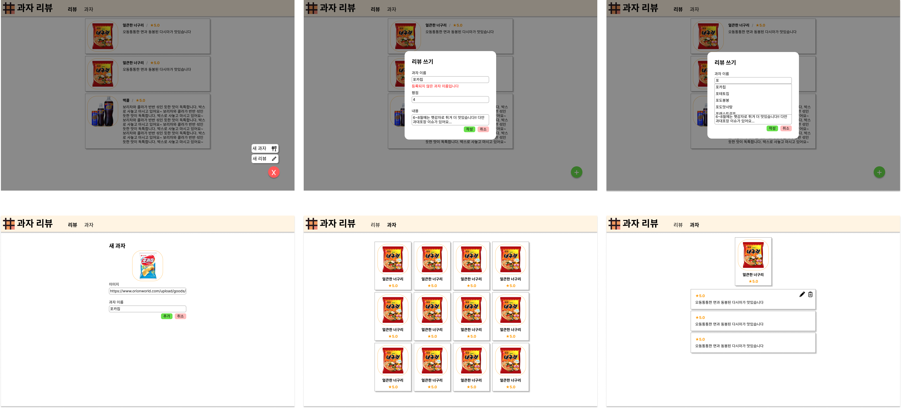

# React 과제 2

## 과제 목적

- Context API를 통해 전역 상태를 효과적으로 관리한다
- React Router를 통해 클라이언트 라우팅 앱을 만든다

## 과제 스펙

리뷰 및 과자 데이터는 Context API를 통해 전역으로 관리한다. 예를 들면 다음과 같은 모듈을 정의할 수 있다:
```ts
// src/contexts/SnackContext.tsx

export type SnackInput = ...
export type Snack = ...
export type ReviewInput = ...
export type Review = ...
export type SnackContextData = {
  snacks: Snack[];
  getSnackById: (id: number) => Snack;
  getSnackByName: (name: string) => Snack | null;
  filterSnacksByName: (query: string) => Snack[];
  addSnack: (snack: SnackInput) => Snack;

  reviews: Review[];
  ...
};

export function SnackProvider ...
export function useSnackContext ...
```

이전 과제를 바탕으로 아래 기능을 추가/수정한다:
- 초기 데이터(리뷰, 과자)는 비워둔다.
- 헤더 메뉴 (모든 페이지)
  - "리뷰"를 클릭하면 `/`로 이동
  - "과자"를 클릭하면 `/snacks`로 이동
  - 리뷰 페이지, 과자 페이지에서는 해당 메뉴가 굵게 표시된다
- 리뷰 쓰기 (`/`, 모달로 처리)
  - 리뷰 쓰기 창에서 과자 이름은 자동완성된다.
    - 과자 이름을 한 글자 입력할 때마다 리스트가 바뀐다.
      - 입력된 문자열 query와 과자 이름 name에 대해 다음 값이 true인 것만을 포함하면 충분하다: `name.replace(' ', '').includes(query.replace(' ', ''))`
      - (보너스) 한글 자동완성을 구현해도 좋다. 단, 종성이 없는 한글 및 공백으로만 이루어진 입력/이름(예: 쿠크/쿠크다스)에 대해서는 위의 간단한 방법으로 비교한 것과 같은 결과가 나와야 한다.
    - 리스트의 길이가 너무 길어지지 않도록 한다.
    - 리스트의 항목을 클릭하면 입력창의 내용이 해당 이름으로 바뀐다.
    - 입력창이 포커스를 잃으면 0.2초 후에 리스트가 사라진다.
      - 리스트의 항목을 클릭하기 전에 리스트가 사라지는 것을 막기 위해 약간의 딜레이를 준다.
    - 리뷰 생성 버튼을 누를 때 과자 이름이 잘못된 경우 이전 과제에서처럼 오류 메시지를 보여준다.
  - 이미지 url는 따로 입력하지 않는다.
- 새 과자 페이지 (`/snacks/new`)
  - 과자 이름, 이미지 url, 제조사를 입력한다.
  - 각 입력의 조건은 이전 과제와 비슷하다:
    - 과자 이름: 첫글자와 끝글자가 공백이 아닌 1~20자의 문자열.
    - 이미지 url: 반드시 1자 이상의 문자열로 작성해야 한다.
    - 제조사: 첫글자와 끝글자가 공백이 아닌 1~20자의 문자열.
  - (보너스) 이전 과제에서와 같이 미리보기 이미지를 띄울 수 있다.
  - 과자 이름은 중복될 수 없다.
  - 올바르게 입력한 후 1초가 지나서 "추가" 버튼을 누르면 과자가 추가되고 해당 과자의 페이지(`/snacks/:id`)로 이동한다.
  - 잘못된 입력을 한 후 "추가" 버튼을 누르면, 리뷰 쓰기 모달에서와 각각의 오류에 대해 같이 오류 메시지를 보여준다.
  - "취소" 버튼을 누르면 이전 페이지로 돌아간다.
- 리뷰 목록 페이지 (`/`)
  - 과자 이름이나 사진을 클릭하면 과자 페이지로 이동한다.
  - 우하단의 "+" 버튼을 누르면 메뉴가 나타난다.
    - "새 리뷰" 버튼을 누르면 메뉴는 사라지고 리뷰 쓰기 모달이 나타난다.
    - "새 과자" 버튼을 누르면 새 과자 페이지로 이동한다.
  - 화면의 다른 곳을 클릭하거나 "x"로 바뀐 버튼을 누르면 메뉴가 사라진다.
    - (힌트) `useEffect` 함수로 전역 클릭 이벤트를 등록한다.
- 과자 목록 페이지 (`/snacks`)
  - 과자들의 이름과 이미지, 평균 평점이 나타난다.
  - 평균 평점은 이번 과제의 경우 구현할 필요 없다.
- 과자 페이지 (`/snacks/:id`)
  - 과자의 이름과 이미지,평점이 나타난다.
  - 과자에 달린 리뷰가 생성된 역순으로 나타난다.
  - 리뷰 페이지에서와 같이 수정 및 삭제가 가능하다.

UI는 아래 이미지를 참고한다:

