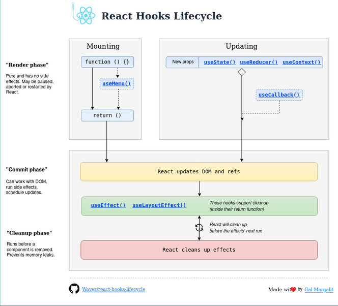
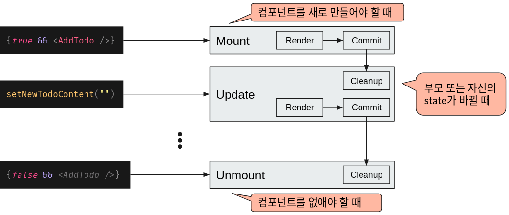
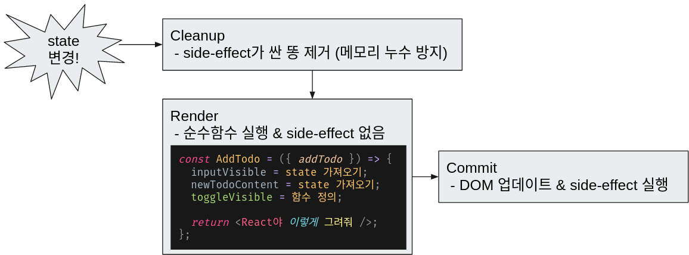
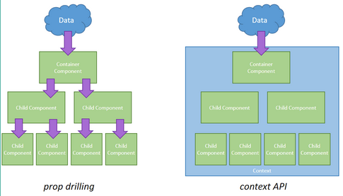
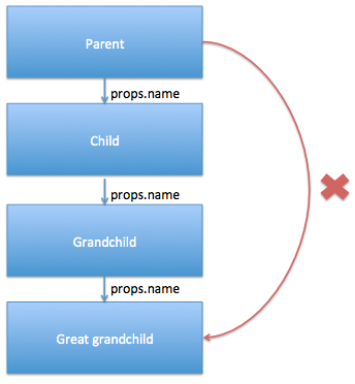
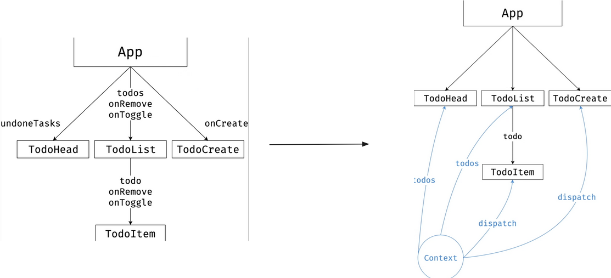
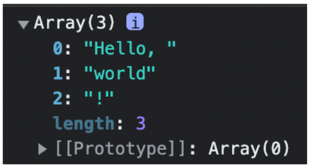
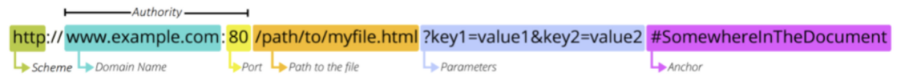
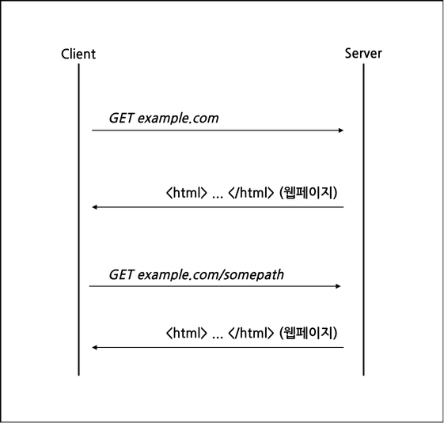
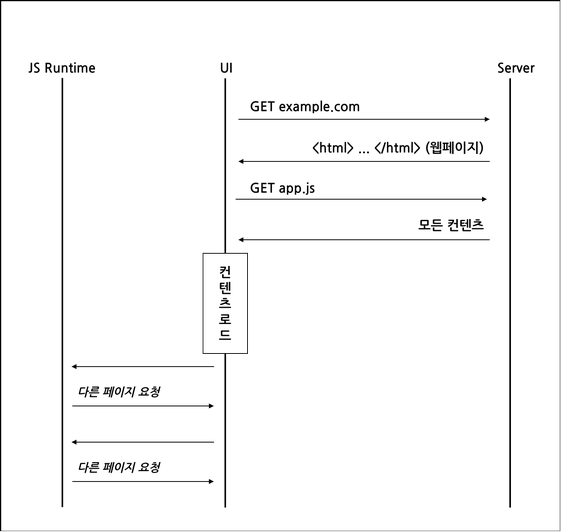

<!-- _class: lead -->

<style>
section {
  justify-content: flex-start;
}
section.lead {
  justify-content: center;
}
section.lead > h1 {
  font-size: 3rem;
}
ul {
  margin-bottom: 1rem;
}
</style>

# Waffle Studio<br>Frontend Seminar - 2

---

# 개요

- 컴포넌트 생명주기
- 훅 (Hook)
- Context API
  - state 등을 전역으로 관리
- 라우팅
  - 하나의 앱에서 여러 페이지 이용하기

---

<!-- _class: lead -->

# 컴포넌트<br>생명주기



---

# Component Lifecycle

- 코드를 짜긴 했는데 이게 언제 실행되는 거지?
- 앱이 딱 켜졌을 때 뭔가를 할 수는 없을까?
- 컴포넌트가 언제 렌더되는 거지?

---

# Component Lifecycle의 주요 개념

- Mount - Update - Unmount: 나서 자라고 죽음
- Render - Commit - Cleanup: 상 차리고 먹고 설거지

---

# Mount - Update - Unmount



---

# Render - Commit - Cleanup



---

# Mount - Render - Unmount 테스트

<div style=display:flex;font-size:1.5rem><div style=flex:1>

- Mount:
  render1 - render2 - side effect
- Update:
  render1 - render2 - cleanup - side effect
- Unmount:
  cleanup

</div><div style=flex:1>

```js
function MyComponent() {
  console.log("render1");
  useEffect(() => {
    console.log("side effect");
    return () => { 
      console.log("cleanup");
    };
  });
  console.log("render2");
  /* ... */
}
```

</div>

---

# Q&A

---

<!-- _class: lead -->

# 훅 (Hook)


---

# 훅이란?

- “함수 컴포넌트에서 React state와 생명주기 기능(lifecycle features)을 ‘연동(hook into)’할 수 있게 해주는 함수”
- 평범한 함수에서 리액트 기능을 쓸 수 있는 마법

---

# 여러가지 훅

- useState
- useEffect
- useMemo
- useCallback
- ...

---

# useState(*initial*)

- 컴포넌트의 state를 선언하는 훅

- *initial*: state의 초기값을 설정
  - 마운트할 때만 사용, 업데이트할 때는 무시된다
  - state의 초기값을 리턴하는 함수를 넣어주면 마운트할 때만 호출된다

- [*state*, *dispatcher*] 형태의 배열을 리턴

```js
const [value, setValue] = useState(0);
const [thing, setThing] = useState(() => new SomeComplexObject(...));
```

---

# useState(*initial*)

- *dispatcher*를 호출하여 상태 값을 변경할 수 있다
- 새로운 상태 값을 그대로,
- 또는 새로운 상태 값을 만들어내는 함수를 인자로 넣는다

```js
const [value, setValue] = useState(0);
setValue(value + 1);
setValue(v => v + 1);
```

- 함수를 상태로 사용할 때는 각별한 주의가 필요하다

```js
const [fun, setFun] = useState(() => (a, b) => a + b);
setFun(() => (a, b) => a + b);
// fun(2, 3) == 5
```

---

<style>section { font-size: 1.5rem; }</style>

# useEffect(*setup*, *deps*)

- 렌더링 과정에서는 실행할 수 없는 부작용(side effect)를 수행하는 훅
  - 예시: 백엔드 통신, 전역 이벤트 리스너 등록, ...
- 리액트 바깥의 시스템과 내부의 state를 맞추기 위한 함수
- 렌더링할 때마다 commit phase에 실행됨
  - 의존성 배열(*deps*)로 최적화 가능

```js
function MyComponent() {
  useEffect(() => {
    const onMouseUp = (e) => { /* ... */ };
    window.addEventListener("mouseup", onMouseUp);
    return () => {
      window.removeEventListener("mouseup", onMouseUp);
    };
  });
  /* ... */
}
```

---

# 의존성 배열

- *setup* 함수 안에서 사용된 값을 모두 나열하는 배열
- 배열의 내용이 바뀌면 effect가 실행된다
- eslint 등 적절한 도구를 쓰면 IDE가 자동으로 채워준다

---

# useMemo(*calculate*, *deps*)

- 렌더될 때마다 너무 무거운 코드를 굳이 반복적으로 실행하게 될 때가 있다
- useMemo를 쓰면 렌더링마다 새로 값을 만들지 않고 이전에 기록된 값을 사용

```js
function App() {
  const fib = fibonacci(input);
  /* ... */
}
```
```js
function App() {
  const fib = useMemo(() => fibonacci(input), [input]);
  /* ... */
}
```

---

# useCallback(*func*, *deps*)

- 의존성 배열에 함수가 들어가면, 렌더링할 때마다 함수가 새로 생성되어 의도한 최적화가 이루어지지 못함
- useCallback을 통해 해결

```ts
const handleClick = useCallback(() => {
setCount(count + 1);
}, [count])
```

---

# useMemo와 useCallback이 언제 필요할까?

- 렌더링이 너무 오래 & 자주 실행되는 경우
  - 예를 들면, 10,000개의 컴포넌트가 매번 렌더링될 때?
  - 일단 최적화 없이 짜놓고, 너무 느리다 싶으면 최적화하면 된다

---

# useRef(*initial*)

- 리액트가 생성한 DOM 요소를 직접 건드려야 할 때 사용
  - useRef가 리턴한 값을 `ref` props로 넣어준다
- 가끔 불변성을 깨고 싶을 때도 쓸 수 있다
  - 많은 경우에는 useState를 쓰면서 불변성을 유지하는 방법을 찾는 게 좋다

```ts
const inputRef = useRef<HTMLInputElement | null>(null);
return <form>
  <input ref={inputRef} />
  <button onClick={() => inputRef.current?.focus()}>
    focus
  </button>
</form>
```

---

# 기타 Hook

- React 내장 훅
- useRef
- useReducer
- 라이브러리가 제공하는 훅
  - useLocation
  - useRouteMatch
  - useParams
- 커스텀 훅
  - 나중에 다뤄볼게요

---

# [훅의 규칙](https://react.dev/warnings/invalid-hook-call-warning)

- 훅을 반복문, 조건문, 중첩 함수 안에서 호출하면 안 된다.
- 컴포넌트 함수(또는 커스텀 훅)의 가장 바깥쪽 블록에서, 리턴 이전에만 호출한다.

  - ✅ Call them at the top level in the body of a function component.
  - ✅ Call them at the top level in the body of a custom Hook.
  - 🔴 Do not call Hooks inside conditions or loops.
  - 🔴 Do not call Hooks after a conditional return statement.
  - 🔴 Do not call Hooks in event handlers.
  - 🔴 Do not call Hooks in class components.
  - 🔴 Do not call Hooks inside functions passed to useMemo, useReducer, or useEffect.


---

# Q&A

---

<!-- _class: lead -->

# Context API



---

# Props Drilling

<div style=display:flex><div style=flex:1>

지금까지는...
- props 사용
- 자식 component → 손자 component → …
- 부모 rerender → 자식도 전부 rerender

</div>



</div>

---

# 앱이 작으면 문제 없지만, 앱이 크다면?

props drilling을 하지 않기 위한 + 성능 개선을 위한 몸부림


---

# Props Drilling을 하지 않기 위한 몸부림

- Context API
  - 리액트에서 공식적으로 지원하는 **전역 값 관리 도구**

- Redux
  - 그동안 `React = React + Redux` 라고 생각되었을 정도로 “모두가” 사용하던 **상태 관리 라이브러리**
  - 요즘은 여러 가지 불편과 좋은 대체재들로 인해 이전보단 인기가 식었음 (“다 쓰는” → “거의 다 쓰는")
  - 그래도 여전히 취업을 고려하거나 상태가 복잡한 앱을 짜고 싶다면 반드시 공부해야 하는 라이브러리

- Recoil
- MobX

---

# Context API

- useState + useContext 조합
  - 전역에서 쓸 값 + 값을 바꿀 함수
  - 이렇게 해서 전역 상태 관리할 때 Context를 사용할 수 있다
- 물론 단순히 props drilling 하기 싫을 때도 Context API를 쓸 수 있다

---

# Context에서 값을 가져오는 useContext

- useContext(*Context*)
  - 중간 component는 건너뛰고, 하위 컴포넌트들에게 전역으로 값 전달
  - createContext(*placeholder*)
  - <*Context*.Provider value={*value*}>

---



---

# Context API 사용법

```ts
import { createContext, useContext } from "react";

const CounterContext = createContext<number | null>(null);

function Child() {
 const count = useContext(CounterContext);

 return <h1>Count: {count}</h1>;
}

function App() {
 return (
   <CounterContext.Provider value={1}>
     <Child />
   </CounterContext.Provider>
 );
}

export default App;
```

---

<style>pre{font-size:0.9rem}</style>

# Context + 상태관리 예제

```ts
import { createContext, useCallback, useContext, useState } from "react";

type Counter = {
  count: number;
  increase: () => void;
};

const CounterContext = createContext<Counter | null>(null);

function Child() {
 const { count, increase } = useContext(CounterContext);
 return <button onClick={() => increase()}>Count: {count}</button>;
}

function App() {
 const [count, setCount] = useState(1);
 const increase = useCallback(() => setCount((x) => x + 1), []);
 return (
   <CounterContext.Provider
     value={{
       count,
       increase,
     }}
   >
     <Child />
   </CounterContext.Provider>
 );
}

export default App;
```

---

# Context + 상태관리의 일반적 형태

- context/CounterContext.tsx
```ts
import { createContext, useCallback, useContext, useState, ReactNode } from "react";

const initialState = {
};

const CounterContext = createContext({
 count: 1,
 increment: (): number => { throw new Error("CounterContext not found"); },
});

export function CounterProvider({ children }: { children: ReactNode }) {
 const [count, setCount] = useState(1);
 const increment = useCallback(() => setCount((x) => x + 1), []);
 return (
   <CounterContext.Provider
     value={{
       count,
       increment,
     }}
   >
     {children}
   </CounterContext.Provider>
 );
}

export const useCounterContext = () => useContext(CounterContext);
```

---

# Context + 상태관리의 일반적 형태

- index.tsx
```ts
const root = ReactDOM.createRoot(
    document.getElementById("root")
);
root.render(
 <React.StrictMode>
   <CounterProvider>
     <App />
   </CounterProvider>
 </React.StrictMode>
);
```

- components/Child.tsx
```ts
export default function Child() {
  const { count, increment } = useCounterContext();
  return (
    <button onClick={increment}>
      Count: {count}
    </button>
  );
}
```

---

# 번외: children?

- JSX에서 자식으로 넣어주는 값
- 단일한 아무 값, 또는 배열

<div style=display:flex><div style=flex:1>

```ts
function Child({ children }: { children: ReactNode }) {
  console.log(children);
  return <h1>{children}</h1>;
}

function App() {
  const name = "world";
  return <Child>Hello, {name}!</Child>;
}

export default App;
```

</div>



</div>

---

# Context API와 상태관리

- 상태관리에 필수인가?
  - 규모가 아주 작다면 그냥 useState로 쓰는 게 편할 수도 있음 (가령 지난번 todo list 나 루키 코테 사이트 정도)
  - 애초에 상태관리 도구가 아님: “값을 전역으로 사용할 수 있으니” 상태를 넣어서 상태에 전역 접근하는 것 뿐
- 규모가 작지 않다면 상태관리에 Context를 사용해도 좋을 것
- 규모가 커지면 성능 및 유지보수 이슈 때문에 상태 관리 라이브러리를 사용해야 한다

---

# Redux

- 난이도 문제로 이 세미나에서 다루지는 않지만 (아마) 그럼에도 너무너무너무 중요한 라이브러리
- action + dispatch + reducer로 거대한 상태를 깔끔하게 관리하게 해줌
- Context API에 비해 성능도 우수하고 기능도 많음
- 프로그래머 승격 후 공부 우선순위 1순위
- 리덕스 쓸줄 모르면 취업 못하는 수준

---

# Q&A

---

<!-- _class: lead -->

# 라우팅

---

# 라우팅 (참고: [MDN](https://developer.mozilla.org/en-US/docs/Learn/Common_questions/What_is_a_URL))



어떤 주소에 어떤 UI를?
클라이언트 또는 서버가 담당

---

# MPA

- Multi-Page App
- URL path가 바뀌면
  - 서버에서 새로운 HTML 문서를 만들어서 보내준다
- 서버가 라우팅 담당
- 예시: MDN



---

# SPA

- Single Page App
- URL path가 바뀌면
  - Fetch 등 자바스크립트를 통해 서버에 데이터 요청
  - 데이터가 오면 자바스크립트로 새로 문서를 그린다
- 클라이언트가 라우팅 담당
- 초기 렌더가 느림
- 대신 페이지 전환이 빠른 편
- 예시: 리크루팅 사이트



---

# MPA vs SPA

<div style=display:flex><div style=flex:1>

- MPA
  - 전통적인 방식
  - 페이지 렌더가 빠르다는 장점
  - 하지만 서버가 힘들다는 단점
  - SSR 방식: 서버에서 페이지 생성
  - 최근 SSR을 하고 싶어서 다시 부흥하는 분위기
    - 리액트 + MPA  :  Next.js 등

</div><div style=flex:1>

- SPA
  - 모바일 시장과 함께 부흥
  - 페이지 초기 렌더가 느리다는 단점
  - 하지만 한번 렌더되고 나서는 빠르고, 서버도 덜 고생함
  - CSR 방식: 브라우저가 페이지 생성
  - 최근 CSR의 단점으로 MPA 방식에 밀리는 분위기
  - ~~Create-React-App~~, create-vite-app react-ts

</div></div>

---

# React-Router

- 리액트의 대표적인 라우팅 라이브러리
- yarn add react-router-dom
- npm install react-router-dom

## 번외: 패키지 관리

- npm, yarn
  자바스크립트 패키지 관리 툴
- package.json
  현재 자바스크립트 프로젝트의 패키지 목록 등
- yarn add, npm install
  현재 프로젝트에 패키지 추가

---

# createBrowserRouter(*routes*)

- react-dom 외에도 React Native, SSR 등 여러 형태로 라우팅이 가능한 라이브러리
- SPA로 만들 때는 브라우저 라우터를 쓴다
- *routes*: 각 URL에 어떤 컴포넌트를 보여줄지 설정하는 배열
  - path: URL의 형태를 나타내는 문자열
  - element: 보여줄 JSX
  - children: 하위 URL에 보여줄 라우트를 설정할 수 있다. (선택)

---

# 예시

```ts
const router = createBrowserRouter([
  {
    path: "about",
    element: <About />
  },
  {
    path: "posts",
    element: <PostListPage />
    children: [
      {
        path: ":postId",
        element: <PostViewPage />
      },
      {
        path: ":postId/edit",
        element: <PostEditPage />
      }
    ]
  },
  {
    path: "*",
    element: <Navigate to="posts">
  }
]);
```
---

# &lt;RouterProvider router={*router*} />

- 실제 라우팅을 하기 위한 진입점
- main.tsx에 `<App />` 대신 라우터를 넣어준다

```ts
ReactDOM.createRoot(document.getElementById("root")!).render(
  <React.StrictMode>
    <RouterProvider router={router} />
  </React.StrictMode>
);
```

---

# &lt;Navigate to={*url*} />

- 리다이렉트를 위한 컴포넌트
- 라우트에서 element로 넣어주면 fallback url을 만들 수 있다

---

# &lt;Link to={*url*} />

- 내부 페이지 링크를 만드는 컴포넌트
- `a` 태그로 렌더링 된다
- 일반적인 링크와 달리 새로고침이 일어나지 않는다
- 외부 URL로 연결할 때는 여전히 `a`를 사용한다

```ts
<Link to="/posts">글 목록</Link>
<a href="https://github.com">깃허브</a>
```

---

# useParams()

- URL의 path에서 동적인 부분의 값을 받아온다
- 예시: github.com/**joongwon** vs github.com/**woohm402**
  - React Router에서는 `/:user`와 같이 나타낸다
  - 해당 파라미터는 아래와 같이 받아오게 된다
  - 타입이 `string | undefined`로 잡히니 주의
```ts
const { user } = useParams();
```

---

# useSearchParams()

- URL의 쿼리 부분을 받아온다
- 예시: www.google.com/search**?channel=fs&client=ubuntu-sn&q=asdf**
- `useState()`와 같이 퀴리 값과 쿼리를 바꾸는 함수의 배열을 리턴한다.
- 역시 타입이 `string | undefined`로 잡힌다
```ts
const [searchParams, setSearchParams] = useSearchParams();
const q = searchParams.get("q"); // "asdf"
```

---

# useNavigate()

- 이벤트 핸들러 등의 콜백에서 URL을 바꾸는 함수를 리턴한다
- URL을 문자열로 넣어 특정 페이지로 이동하거나
- `-1` 값을 넣어 뒤로 가기도 가능하다

```
const navigate = useNavigate();
<button onClick={() => navigate(`/posts/${postId}`)}>포스트</button>
```

---

# Q&A

---

# 과제

- 준비중입니다ㅠ
- 내일까지 올리도록 하겠습니다
