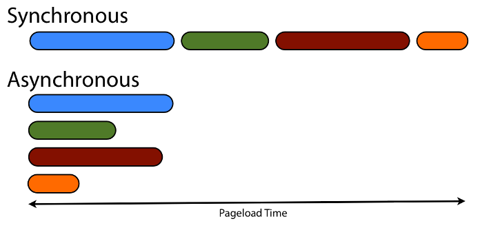
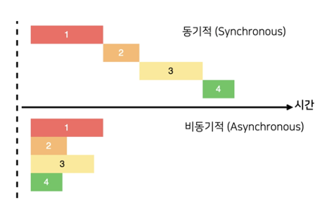
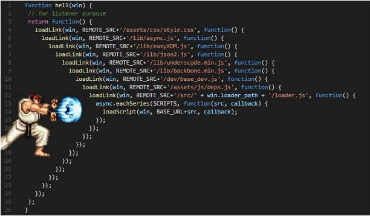
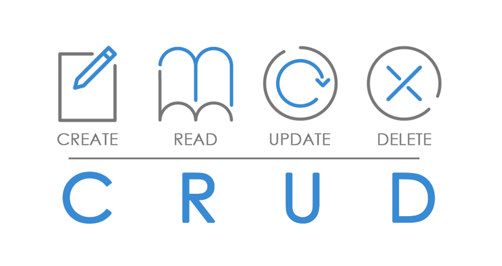
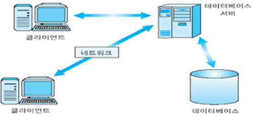
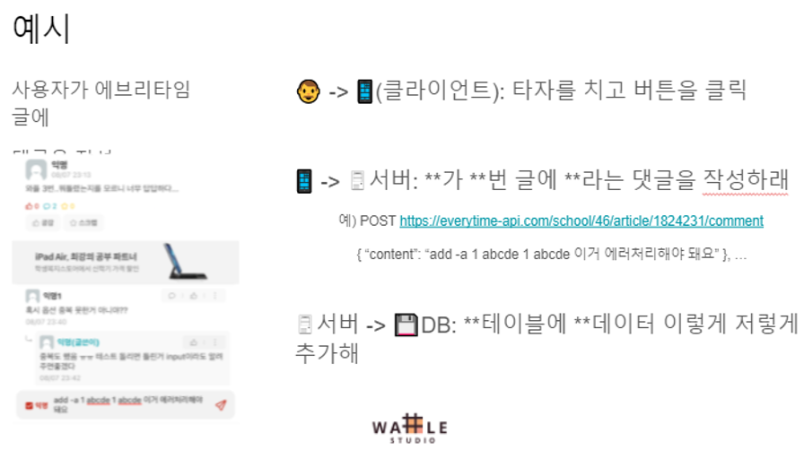
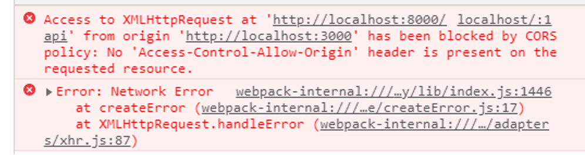

<!-- _class: lead -->
<style>
section {
  justify-content: flex-start;
}
section.lead {
  justify-content: center;
}
section.lead > h1 {
  font-size: 3rem;
}
ul {
  margin-bottom: 1rem;
}
section > div.vs {
  display: flex;
  gap: 0.5rem;
}
section > div.vs > * {
  flex: 1;
}
</style>

# Waffle Studio<br>Frontend Seminar - 3

---
# 오늘 수업
서버 연결!
오늘 수업까지 끝나면 이론상 웬만한 사이트의 프론트엔드는 구현 가능 (채팅 빼고)
- github, stack overflow, 에브리타임, eTL 등등
지금까지는 “만드는 방법"을 배우기 위해 달렸고, 세미나 4 5에서는 좀더 깊은 영역 + 개선 방안을 공부

---
# 목차
1. 비동기 처리
2. 서버 연결하기 (+ ɑ)
    a. 이론 좀 하고
    b. Promise 어떻게 쓰냐
3. HTTP 통신
    a. 그래서 통신 어떻게 하냐
    b. 서버 연결할 때 알아야 할 것들

---

# Contents

<div style="display:flex;font-size:1.0rem"><div style="flex:1">

## 비동기 통신

- 이론
    - 이벤트 루프
    - blocking vs non-blocking
    - 동기 vs 비동기
- 전통적인 비동기 처리: 콜백
    - 콜백 지옥
- Promise를 이용한 비동기 처리
    - Promise의 원리
    - async / await로 Promise 다루기

</div><div style="flex:1">

## HTTP 통신

- HTTP 기초
    - 클라이언트 - 서버 구조
    - CRUD
    - JSON
    - HTTP
    - API
    - RESTful API
        - 번외: API 문서
- axios를 이용한 HTTP 통신
- 기타
    - 쿠키와 세션
    - 인증
    - CSRF
    - CORS

</div></div>

---
<!-- _class: lead -->

# 비동기 처리

Promise를 통해 비동기 처리를 하는 법을 공부하기 위한 장황한 설명
리액트는 잠시 접어두고, 자바스크립트 Promise를 공부해 보겠습니다
[추천 튜토리얼](https://learnjs.vlpt.us/async/01-promise.html) - 비동기

---
<!-- _class: lead -->

## 동기 vs 비동기


---
# 동기 (synchronous)

Javascript는 [never blocking](https://developer.mozilla.org/en-US/docs/Web/JavaScript/EventLoop#never_blocking)을 표방하기 때문에 C언어로 예를 들겠습니다.

```c
#include <stdio.h>

int main(void) {
  int a, b;
  printf("a: ");
  scanf("%d", &a);
  printf("b: ");
  scanf("%d", &b);
  printf("%d + %d = %d\n", a, b, a + b);
  return 0;
}
```

---
# 동기 (synchronous)

Javascript는 [never blocking](https://developer.mozilla.org/en-US/docs/Web/JavaScript/EventLoop#never_blocking)을 표방하기 때문에 C언어로 예를 들겠습니다.

* `printf("a: ");`
* `scanf("%d", &a);`
* `printf("b: ");`
* `scanf("%d", &b);`
* `printf("%d + %d = %d\n", a, b, a + b);`
* `return 0;`

---
# 비동기 (asynchronous)

- 주로 기다리는 시간이 뭔가 하고 있는 시간보다 긴 작업들을 비동기로 처리합니다
  - e. g. 파일 입출력, HTTP 통신, 딜레이
```js
console.log("포스트 가져오겠습니다~");
fetch(URL)
  .then(res => res.json())
  .then(json => console.log(json));
console.log("가져오고 있겠죠?");
```

---
# 비동기 (asynchronous)

- 주로 기다리는 시간이 뭔가 하고 있는 시간보다 긴 작업들을 비동기로 처리합니다
  - e. g. 파일 입출력, HTTP 통신, 딜레이
* `console.log("포스트 가져오겠습니다~");`
* `fetch(URL).then(...).then(...);`
* `console.log("가져오고 있겠죠?");`
* `res.json()`
* `console.log(json)`

---
# 동기 vs 비동기

- 비동기를 이용하면 여러 작업을 시작해놓을 수 있다
- 동시에 작업이 진행되므로 시간이 훨씬 덜 걸린다
- 비동기 작업 사이사이에 다른 이벤트를 처리할 수도 있다.



---
# 프론트에서 동기 vs 비동기

<div style=display:flex><div style=flex:1>

## 동기
1. 서버한테 요청 보내고 기다리기
2. 1분 이따 서버한테 응답 오면 페이지 그리기
3. 그럼 그 1분동안 페이지는 뻗어 있어야 함

</div><div style=flex:1>

## 비동기
1. 서버한테 요청 보내고 내 할 일 하기
2. 1분 이따 서버한테 응답 오면 거기에 맞춰서
3. 하던 일이랑 서버한테 응답 온거랑 해서 어떻게 잘 처리

</div></div>



---
# 비동기의 필요성 확인하기

예제로 확인 ([why-async](./why-async))
로딩중일 때도 모달은 열려야 하고, 페이지가 작동은 해야 함

---
# 결론: 어렵지만 비동기 처리를 공부해서 사용해야 한다!

아무튼 비동기를 배워야 한다는 말
사실 JS가 비동기 쓰라고 강제합니다

---
# 예제 (1)

대충 비동기로 돌아가는 간단한 예시

```js
const sayCheck = () => console.log("check");
console.log("check 1");
setTimeout(sayCheck, 2000);
console.log("check 2");
```

---
# 예제 (2)

실제로 다른 서버랑 비동기로 통신을 하는 예시

```js
console.log("check 1");
fetch('https://jsonplaceholder.typicode.com/todos')
  .then(res => res.json())
  .then(console.log);
console.log("check 2");
```

---
# 비동기 원리: 이벤트 루프

---
# 비동기는 신기하다

코드 흐름이 N개로 갈라져 실행되는 마법
그런데 자바스크립트는 싱글스레드?!!

마법의 이름은 이벤트 루프입니다

---
# 코드 흐름이 좀 이상하지 않나요?

파이썬이나 C로 프로그램 짜면 보통…

<div class=vs>

```python
print(“멋진 프로그램”)

print(“뭔가 입력하세요”)

i = input()

# do something

print(“당신이 원한 결과입니다:”, result)

# end of program
```

* (프로그램 시작)
* 출력
* (...입력 대기...)
* 입력
* 작업 수행
* 출력
* (프로그램 종료)

</div>

---
# 코드 흐름이 좀 이상하지 않나요?

하지만 자바스크립트는?

<div class=vs>

```js
/* init data */

/* show something */

addEventListener("click", () => {

  /* update something */

});
```

* (스크립트 시작)
* 초기화
* 화면에 뭔가 띄움
* (스크립트 종료)
* \*클릭\* - (콜백 시작)
* 화면이 뭔가 바뀜
* (콜백 종료)

</div>

---
# 이벤트 루프

내부적으로 대충 이런 느낌의 코드가 돌아가고 있습니다.

```js
while (eventQueue.waitForEvent()) {
  const event = eventQueue.dequeue();
  eventHandler(event);
}
```


---
# 이벤트 루프

<div class=vs>

```js
/* init data */

/* show something */

addEventListener("click", () => {

  /* update something */

});
```

* (스크립트 시작)
* 초기화
* 화면에 뭔가 띄움
* (스크립트 종료)
* (이벤트 루프 도는 중...)
* \*클릭\* - (콜백 시작)
* 화면이 뭔가 바뀜
* (콜백 종료)
* (이벤트 루프 도는 중...)

</div>

---
# Q&A


---

<!-- _class: lead -->

# 콜백: 전통적인 비동기 처리

- 콜백 방식
- 콜백 지옥

내부적으로 비동기가 왜 필요한지 알아봤고, 자스에서 비동기 처리가 가능은 하다는 걸 이해했고, 이걸 어떻게 코드로 구현할까?

---
# Callback Function이란?

<div class=vs><div>

인수로 넘겨주는 실행 가능한 함수
여러분은 이미 콜백을 알고 있습니다
- `fetch`
- `setTimeout`
- `map`, `forEach`, `filter` 등도 콜백 함수를 사용

</div>

```js
const studentList = [...];

studentList.map((item) => {
  return item.id;
});

studentList.forEach((item) => {
  console.log(item);
});

addEventListener("keydown", (e) => {
  if (e.key === "Enter") {
    console.log("do something");
  }
});
```

</div>

---
# 콜백을 이용한 비동기 처리

## 비동기

1. 서버한테 API 보내고 내 할 일 하기
2. **1분 이따 서버한테 응답 오면** 거기에 맞춰서 하던 일이랑 서버한테 응답 온거랑 해서 어떻게 잘 처리

그게 언제인지 모르겠으니, 끝나면 알아서 이 콜백을 실행해라! 라는 아이디어

---
# 콜백을 이용한 비동기 처리

1. 비동기 작업 호출하면서, 끝났을 때 실행할 콜백 함수를 pass
2. 콜백이 실행되면 내가 미리 구현해둔 디자인에 따라 이렇게 저렇게

```js
setTimeout(() => {
  console.log("3초 후에 안녕하세요");
}, 3000);
```

콜백으로 비동기 코드를 구현할 수 있다!

---
# 콜백 방식 예시

만약 fetch를 콜백 방식을 이용해 구현한다면?
- myFetch는 실제로 있는 함수는 아닙니다.
- 콜백으로 짠다면 이렇게 하면 되겠구나!

```js
myFetch("https://jsonplaceholder.typicode.com/posts/1", (res) => {
  console.log(1, res);
});
```

---
# 콜백 지옥

<div class=vs><div>

하나 정도는 괜찮은데, 두 개 이상 겹친다면?
링크를 순서대로 하나씩 불러와보자
여기에 각 step에 대한 에러 핸들링까지 추가되면?
코드 가독성이 폭락
뭔가가 더 필요하다!

</div>



</div>

---
# 주요 흐름 정리
1. 전통적으로는 콜백이라는 방식이 비동기 처리에 사용되었음
2. 하지만 콜백만으로 비동기를 처리하면 가독성이 떨어지고 값 공유, 에러 처리 등이 아주 어려움

---
# Q&A

---
<!-- _class: lead -->

# Promise

- Promise란
- async와 await

https://velog.io/@cadenzah/What-is-a-Promise
자바스크립트에서 비동기 처리를 하기 위한 가장 일반적인 문법

---
# Promise

비동기 처리에 사용되는 특별한 객체
비동기 함수로부터 동기적으로 반환됨
- resolve와 reject를 인자로 받는 콜백 함수를 인자로 받아 생성됨
- 생성 시 특정 작업을 수행한 뒤 resolve나 reject해 주겠다고 “약속”
- resolve된 값은 (프로미스 객체).then() 함수로 접근 가능
- reject된 값은 (프로미스 객체).catch() 함수로 접근 가능

---
# Promise 직접 생성하는 법

콜백 함수를 넘겨 Promise 객체를 만들 수 있다.
콜백 함수는 작업을 수행하고, 완료할 때 resolve를 호출하고, 실패하면 reject를 호출한다.
(사실 직접 생성할 일은 잘 없다)

```js
const delayCallback = (resolve, reject) => {
  setTimeout(() => resolve("result"), 3000);
};

const getMyPromise = () => new Promise(delayCallback);

getMyPromise().then((data) => console.log(data));
```

---
# Promise 사용 예시

대부분의 상황에서 Promise를 직접 생성하지 않고, Promise를 리턴받아서 사용만함
- Promise를 리턴하는 함수들은 내부적으로 resolve/reject가 잘 구현돼 있음 (가령 fetch)
- resolve된 것(성공): .then() 으로 확인
- reject된 것(실패): .catch() 로 확인

---
# Promise 사용 예시 (1) - then, catch
Live Tutorial

아까보다 낫나요?
최소한 위에서 밑으로 내려가잖아요

```
fetch('https://this-is-fake-url')
.then(res => console.log('success'))
.catch(res => console.log('fail'));
```

---
# Promise 사용 예시 (2) - chaining

<div style=font-size:1rem>

```js
fetch("https://jsonplaceholder.typicode.com/posts/1")
  .then((res) => {
    console.log(1, res);
    return fetch("https://jsonplaceholder.typicode.com/posts/2");
  })
  .then((res) => {
    console.log(2, res);
    return fetch("https://jsonplaceholder.typicode.com/posts/3");
  })
  .then((res) => {
    console.log(3, res);
    return fetch("https://jsonplaceholder.typicode.com/posts/4");
  })
  .then((res) => {
    console.log(4, res);
  });
```

</div>

---
# async / await

Promise를 쉽게, 우리가 일반적으로 쓰던 동기 코드처럼 작성하는 문법

<div class=vs>

- 비동기 작업이 끝나면 값을 리턴함
- 함수 선언부: async
- Promise의 앞 부분: await
- 에러 캐치는 보통 try/catch 사용
- async 함수는 항상 Promise를 리턴

```js
async function task() {
  const res1 = await fetch("https://jsonplaceholder.typicode.com/posts/1");
  console.log(1, res1);

  const res2 = await fetch("https://jsonplaceholder.typicode.com/posts/2");
  console.log(2, res2);

  const res3 = await fetch("https://jsonplaceholder.typicode.com/posts/3");
  console.log(3, res3);

  const res4 = await fetch("https://jsonplaceholder.typicode.com/posts/4");
  console.log(4, res4);

}
```

</div>

---
# async / await

두 코드의 동작은 동일합니다

<div class=vs>

```js
async function getPosts() {
  try {
    const res = await fetch("URL");
    const json = await res.json();
    console.log(json);
  } catch (error) {
    console.error(error);
  }
}
```

```js
function getPosts() {
   return fetch("URL")
     .then(res => res.json())
     .then(json => console.log(json))
     .catch(err => console.error(err));
}
```

---
# 흐름 정리
1. 비동기 처리를 좀더 깔끔하고 편하게 할 수 있는 방법에 대한 고민
2. 콜백만 이용할 때보다, Promise를 이용하면 값 공유나 에러 처리도 편하고, 콜백 지옥도 방지됨
3. 모던 웹앱에서 99.9% 이상의 비동기 처리는 Promise를 사용
4. 안타깝게도 러닝 커브가 좀 있음

---
# Q&A

---
<!-- _class: lead -->
# HTTP 통신

---
<!-- _class: lead -->
## HTTP 기초

- 클라이언트 - 서버 구조
- CRUD
- JSON
- API
- HTTP API
- RESTful API
잠시 리액트는 (또) 접어두고, 이론 공부를 먼저 하겠습니다

---
# [배경지식] CRUD: 데이터를 어떻게 다룰까?

<div class=vs>

[글 작성] Create
[글 열람] Read
[글 수정] Update
[글 삭제] Delete


</div>

---
# [배경지식] JSON: 데이터를 어떻게 보낼까?

- JavaScript Object Notation
- “key - value 쌍”

<div class=vs style=font-size:1.5rem>

- key는 무조건 `string`
- value는 
  - null
  - string
  - boolean
  - number
  - value[]
  - key - value 쌍

```json
{
  "age": 21,
  "major": "CSE",
  "language": ["c", "c++", "rust", "javascript"],
  "framework": {
    "frontend": ["react", "vanilla"],
    "backend": ["fastify"],
    "iOS": null
  }
}
```

</div>

JSON 외에 HTML이나 text 등도 보낼 수 있음

---
# [배경지식] 클라이언트 - 서버 구조

- 지금까지는 앱이 메인이 되어 초기 데이터 등을 가지고 있었음
  - 새로고침하면 데이터가 날아가는 문제; 데이터가 저장이 안 된다?
  - 당연히 현실에 이런 서비스는 거의 없음
- 대부분이 채택하는 자연스러운 흐름:
  - 누군가가 데이터를 가지고 있고, 프론트는 거기서 데이터를 불러와서 사용!
  - 백엔드 세미나 들으시는 분들이 서버랑 데이터베이스를 담당
  - 보통 클라이언트는 요청만, 서버는 응답만

<div style=position:absolute;right:80px;bottom:0>



</div>

---
# [배경지식] 클라이언트 - 서버 구조

특성 메소드로
특정 url로
특정 데이터를 전송

<div style=position:absolute;right:80px;bottom:0>



</div>

---
# HTTP ([참고](https://velog.io/@teddybearjung/HTTP-%EA%B5%AC%EC%A1%B0-%EB%B0%8F-%ED%95%B5%EC%8B%AC-%EC%9A%94%EC%86%8C))

HyperText Transfer Protocol
대표적인 통신 규약
request + response

---
# HTTP request

start line / headers / body

<div style=font-size:1.3rem>

- start line
  - 메소드 (GET / POST / …)
  - target uri
  - HTTP version
- headers
  - 사용자 정보
  - 브라우저 정보
  - 쿠키 정보
  - 등등 다양한 메타데이터
- body
  - 전송할 메인 데이터

</div>

<div style=position:absolute;right:80px;bottom:80px>


</div>

---
# HTTP request - method
GET: 정보 가져오기
POST: 생성
PUT: 수정
DELETE: 삭제
PATCH: 부분 수정
등등 ([참고](https://developer.mozilla.org/ko/docs/Web/HTTP/Methods))

---
# HTTP response

status line / headers / body

<div style=font-size:1.3rem>

- status line
  - Status Code
  - Status Text
  - HTTP version
- headers
  - 사용자 정보
  - 브라우저 정보
  - 쿠키 정보
  - 등등 다양한 메타데이터
- body
  - 응답할 메인 데이터

</div>

---
# HTTP response - status code ([위키백과](https://ko.wikipedia.org/wiki/HTTP_%EC%83%81%ED%83%9C_%EC%BD%94%EB%93%9C))

1XX
- 진행중
2XX
- 성공
3XX
- 추가 작업 필요 (리다이렉트 등)
4XX
- 잘못된 요청. 제일 자주 보게 될 오류 코드
5XX
- 서버 에러. 5XX가 났다면 보통 서버 개발자를 때려야 합니다.

---
# HTTP with postman
Postman 직접 한번 써보겠습니다
- URL: https://jsonplaceholder.typicode.com/todos


---
# REST API: HTTP API 디자인 패턴

우리가 보는 건 대부분 REST 방식으로 디자인된 HTTP API입니다

---
# REST방식으로 디자인된 HTTP의 특징

- Connectionless
  - Request 날릴 때 연결하고, Response가 오면 연결이 끊어짐

- Stateless
  - 클라이언트 정보에 대한 상태가 없음
  - 로그인을 유지하고 싶으면? Session or Cookie

---
# [배경지식] API: 데이터를 어떻게 보내라는 약속

Application Programming Interface

- 이를 테면 여러분이 만든 함수를 동료가 사용한다고 할 때,
  함수 파라미터와 동작, 리턴값에 알려주고 이렇게저렇게 쓰기로 약속을 합니다.
- 그러면 동료는 함수 내용을 몰라도 함수를 쓸 수 있어요.
- 그런 약속이 바로 **API**!

---
# [배경지식] API: 데이터를 어떻게 보내라는 약속
- 이쪽 동네에서는 API라고 하면 보통 HTTP API를 의미
- 어느 url로 어떤 요청을 보내면, 어떤 일이 일어나고 어떤 응답이 오나요?
- 서버 개발자가 하는 일이 이걸 만드는 것
- 서버와 클라이언트가 편히 소통할 수 있도록, 팀에서 이 부분을 잘 약속해두는 게 중요함

예시: https://petstore.swagger.io

---
# 가령 우리 세미나 과제라면?

1. 마운트 시 리뷰 목록을 불러오는 API를 호출 (비동기)
2. response가 오면 state에 저장

하고 대기하다가 사용자가 리뷰를 작성하면
1. 리뷰 작성 API 호출 (비동기)
2. response가 오면, 응답 코드를 확인
  a. 성공 시 (201)
    i. 모달을 닫고, 리뷰 목록 불러오는 API를 호출
    ii. response가 오면 state에 저장
  b. 실패 시 (400)
    i. 오류 메시지 출력

예시입니다. 구현 방식은 자유입니다.

---
# 흐름 정리
보통 클라이언트와 서버가 데이터를 주고받음
다양한 방법이 있지만 이 중 **대부분이 차용**하는 흐름은 아래와 같고, 우리도 이 방식을 공부함
- 서버랑 DB가 CRUD 방식으로 데이터를 다루고
- 클라이언트가 서버에 RESTful하게 디자인된 HTTP API를 날려서 상호작용을 함

물론 앱에 따라 DB가 없을 수도 있고, 클라가 없을 수도 있고, http 말고 websocket api를 사용할 수도 있음

---
# Q&A

---

<!-- _class: lead -->
# axios / fetch
아 그래서 통신 어떻게 하는 건데

---
# 그래서 이론을 머리아프게 배웠는데 서버랑 통신하는 걸 대체 어떻게 구현할까?

다양한 방법이 있음; 우리는 fetch와 axios를 살펴볼 예정
- fetch
- XMLHttpRequest
- axios
- JQuery.ajax
- Qwest
- SuperAgent
- Http-client

---
# axios

- Javascript http 비동기 통신 라이브러리
  - 콜백을 사용하는 XMLHttpRequest를 Promise로 감싼 구현
- 비동기니 http니 개념은 어려웠지만, 막상 사용법은 간단함

---
# axios
HTTP 요청을 날리고, 응답 코드에 따라 반환값을 resolve하거나 에러를 reject함
2XX (성공) 일 경우 resolve
그외에는 reject

---
# axios 사용법

`axios.메소드(url, body, options);`

```js
axios.get("https://jsonplaceholder.typicode.com/todos/1")
  .then((res) => console.log(res.data));
  .catch((err) => console.error(err));

axios.post("https://localhost:8080/todos",
  { todo: "세미나 자료 만들기" },
  {
    header: {
      "Authorization": "Bearer some.token",
    },
  })
  .then(...);
```

서버에서 온 응답을 JSON으로 파싱한 Promise 리턴
우리가 원하는 값은 response.data 안에 존재

---
# fetch

- 기본적으로 웹 브라우저에 내장된 함수
- 옛날엔 지원이 잘 안 돼서 항상 axios 썼지만
  지금은 꽤 쓸만하다

---
# fetch
HTTP 요청을 날리고, 응답을 **항상 resolve**
응답 코드가 2XX가 아니더라도 그대로 리턴한다

---
# fetch 사용법

`fetch(url, options);`

```js
fetch("https://jsonplaceholder.typicode.com/todos/1")
  .then((res) => res.json());
  .then((json) => console.log(json));
  .catch((err) => console.error(err));

fetch("https://localhost:8080/todos",
  {
    method: "POST",
    body: JSON.stringify({ todo: "세미나 자료 만들기" }),
    header: {
      "Authorization": "Bearer some.token",
    },
  })
  .then(...);
```

서버에서 온 응답을 Promise로 리턴
요청할 때는 JSON.stringify(data), 응답을 받으면 res.json()를 해줘야 한다.
API 요청을 다 함수로 감싸서 쓴다면 크게 번거롭지는 않을 것

---
# react에서 fetch 사용하는 법
Live Tutorial

```js
import React, { useState } from 'react'

function App() {
  const [num, setNum] = useState("");
  const [content, setContent] = useState("");
  return (
    <div>
      <input type="number" onChange={e => setNum(e.target.value)} value={num} />
      <button onClick={() => {
          if (num === '') return;
          fetch(`https://jsonplaceholder.typicode.com/todos/${num}`)
            .then((r) => r.json())
            .then((j) => setContent(j.title));
        }}>load</button>
      <pre>{content}</pre>
    </div>
  )
}

export default App
```

---
# react + fetch (Best Practice)
- 데이터를 받아와서 state에 저장
  - 이 예제에서는 버튼 클릭 시 데이터를 가져옴
  - 이벤트 리스너나 useEffect() 에서 가져오는 게 일반적
    - 앱이 마운트될 때 등에 자동으로 가져오려고
  - POST나 DELETE 등도 비슷한 구조

---
# http 각종 팁
네트워크 탭 (Live Tutorial)
개발자 도구의 네트워크 탭을 보면 통신하는 내용이 다 뜸
디버깅할 때 아주 유용

---
# 흐름 정리
리액트 앱에서 서버랑 통신하는 걸 어떻게 구현하지?
다양한 방법이 있지만 요즘 대부분의 리액트 프로젝트는 axios를 채택?
사실 잘 모르지만 fetch로 충분

---
# Q&A

---
# 기타
네트워크
브라우저
쿠키와 세션
인증
CSRF
CORS
혼자 로컬에서 개발할 땐 몰라도 됐지만,
서버와 통신을 하게 되면 알아야 하는 것들

---
# [쿠키](https://developer.mozilla.org/ko/docs/Web/HTTP/Cookies)
서버에 의해 브라우저에 저장되는 정보
- set-cookie 헤더 이용
- 보통 로그인 정보 유지 등에 자주 사용됨
- 성능 및 보안 문제로 요즘은 엄청 많이는 사용하지 않는 추세
  - 통신 한번 할 때마다 쿠키 정보를 항상 넘기기 때문
  - 쿠키에 최대한 작은 정보를 넣어두려 함
- expire date를 설정할 수 있어서, n시간 동안 보지 않기 팝업에
  자주 사용
- 요즘 유행하는 대체품: [LocalStorage](https://developer.mozilla.org/ko/docs/Web/API/Window/localStorage)

<div style=position:absolute;top:0;right:0>


</div>

---
# 세션
서버에서 임시로 사용자 브라우저에 대한 정보를 저장 (쿠키와 반대)
- 로그인 정보 유지 등에 사용 (세션 로그인 방식)
- 이 경우에, 클라이언트가 쿠키에 세션 ID를 가지고 있어야 한다

---
# 인증 (authentication)
서버의 요구: “너 누구야! 네가 정말 OOO이라는 걸 증명해봐!”
- 브라우저에서 보내는 정보는 얼마든지 조작될 수 있기 때문에, 이는 서버 입장에서 상당한 고민거리
- 그렇다고 비밀번호를 매번 보낼 수는 없음 (비밀번호는 탈취되면 진짜 망함)
1. 비밀번호 대신 로그인할 때 토큰을 발급해주고 그걸 사용 →JWT 토큰: 임시 열쇠(24시간 후 자동
으로 망가짐)
2. 서버의 세션에 브라우저 정보를 저장 → 쿠키에 세션ID를 저장하고 요청할 때마다 같이 보내게 함
3. 등등 [아주](https://developer.mozilla.org/ko/docs/Web/HTTP/Authentication)[ ](https://developer.mozilla.org/ko/docs/Web/HTTP/Authentication)[다양한](https://developer.mozilla.org/ko/docs/Web/HTTP/Authentication)[ ](https://developer.mozilla.org/ko/docs/Web/HTTP/Authentication)[방법](https://developer.mozilla.org/ko/docs/Web/HTTP/Authentication)이 존재

---
# 인가 (authorization)
매 요청마다 자기가 누군지 증명하라고 요구하는 건 비효율적이다.
“인증”은 한번만 하고, 그 다음부터는 “아는 얼굴이니까 무슨 권한 있는지만 확인할게~”
1. JWT 토큰: 토큰에 저장된 사용자 ID와 권한 정보 활용
2. 세션: 서버에 저장된 브라우저 정보를 통해 사용자 ID와 권한 확인

---
# 인증 - JWT 토큰 방식
- Json Web Token
- JWT: Json 객체를 암호화하는 표준
- JWT 토큰 방식: 유저를 식별할 수 있는 정보를 담고 있는 암호화된 토큰으로 사용자를 인증
- 장점
  - 사용자 정보를 서버가 유지하지 않아도 됨 (RESTful)
- 단점
  - 서버 개발자의 실수에 의해, 본인이 아닌데도 토큰을 조작하여 생성할 수 있음
  - 로그아웃 처리가 불가능함
    - 세션 로그인 방식이면 서버에 저장된 해당 유저 세션을 날리면 그게 로그아웃 (깔끔)
    - JWT 토큰은 발행할 때 만료시간을 정할 수는 있어도 강제로 만료시킬 수는 없는데, 로그아웃을 어떻게 처리하지?

---
# 웹 보안 (1) XSS / CSRF 공격
웹은 개발자 도구 뜯으면 api든 source든 다 나올 정도로 개방적임
- [XSS (Cross-Site Scripting)](https://noirstar.tistory.com/266)
  - 사용자가 사이트를 신뢰한다는 걸 이용
  - 사용자의 사이트에 악의적인 자바스크립트 코드를 삽입하여 지속적인 리디렉션을 유발하거나 쿠키를 탈취
  - https, CORS 등으로 어느 정도 해결
- [CSRF (Cross-site request forgery)](https://blog.naver.com/PostView.nhn?isHttpsRedirect=true&blogId=nahejae533&logNo=221000385231&parentCategoryNo=&categoryNo=&viewDate=&isShowPopularPosts=false&from=postView)
  - 사용자가 브라우저를 신뢰한다는 걸 이용
  - 악의적인 스크립트를 올려 사용자가 그걸 실행하게
  - [옥션 해킹사건](https://namu.wiki/w/%EA%B0%9C%EC%9D%B8%EC%A0%95%EB%B3%B4%20%EC%9C%A0%EC%B6%9C%EC%82%AC%ED%83%9C#s-2.1.2)(2008) 에 이용된 수법
  - CSRF Token과 CORS 등으로 어느 정도 해결

---
# 웹 보안 (2) HTTPS
HTTPS: HyperText Transfer Protocol over Secure Socket Layer
- SSL을 이용해서 전송되는 데이터를 암호화
- HTTP보다 안전하고 복잡함
- 대부분 사이트는 HTTPS를 이용하기를 권장

---
# 웹 보안 (3) CORS
서버와 같이 일하다 보면, 서버에 request를 날렸을 때 저런 알 수 없는 에러가 나는 경우가 있음



---
# 웹 보안 (3) CORS
[SOP (Same Origin Policy)](https://developer.mozilla.org/ko/docs/Web/Security/Same-origin_policy): 같은 출처 (origin: host + port)에서만 리소스 공유를 허용하겠다!
- 잠재적으로 해로울 수 있는 문서들을 배제하여, 공격 (해킹) 경로를 줄이는 역할
하지만, SOP를 무작정 지키기엔, 다른 출처의 리소스 사용은 흔하디 흔한 일
- CORS (Cross-Origin Resource Sharing): 다른 출처의 리소스 사용을 허용하기 위한 규칙 체제
- HTTP response에 Access-Control-Allow-Origin 헤더를 포함함으로서 다른 출처의 리소스를 사용할 수 있게 하는 건데
- 에러 나면 구글링할 것도 없이 서버 개발자한테 내 도메인 열어달라고 요청하면 됨

---
# 흐름 정리
쿠키와 세션이란?
인증이란?
웹 보안
- 대표적인 공격 방식: XSS, CSRF
- 방지를 위한 보안 방식: SOP + CORS, CSRF Token 등

---
# Q&A

---
# 오늘의 큰 목표: 서버 연결하기
오늘 배운 거 총정리!
1. (배경지식) 서버와 통신, 파일 읽기 등 오래 걸리는 상황에서는 비동기 처리를 해야 한다!
a. 자바스크립트에서는 Promise로 비동기를 구현한다!
1. 비동기 작업 중, 서버와 HTTP 통신을 어떻게 하냐!
a. HTTP 통신이 뭐냐!
b. 통신할 때는 fetch/axios 써라!
1. 기타 서버랑 연결을 할 때 신경써야 되는 게 있냐!
a. 당연하지! 쿠키 세션 인증 XSS CSRF SOP CORS 등등등등등

---
# 과제

- 백엔드와 연결하는 과제를 낼 예정
- 백엔드 서버도 만들고 과제 스펙도 정리해서 내도록 하겠습니다
- 아마 과제2 마감 후에 낼듯
